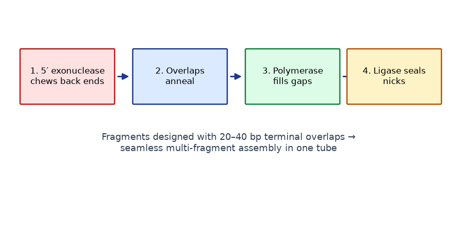
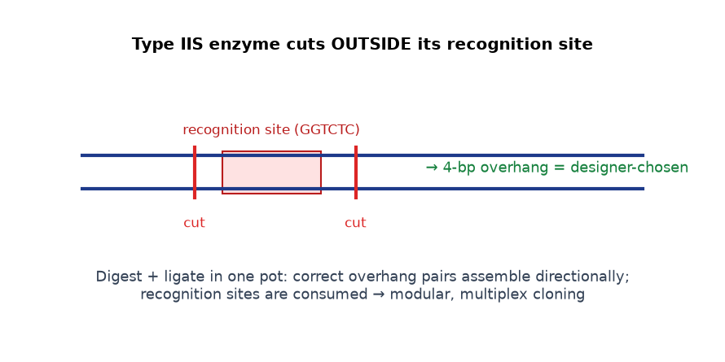
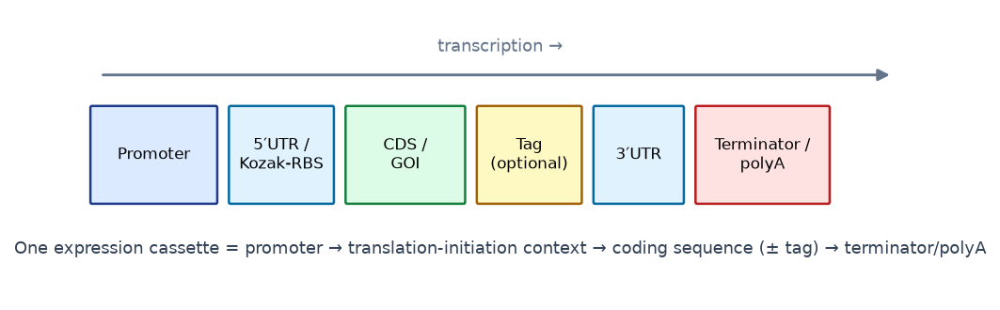
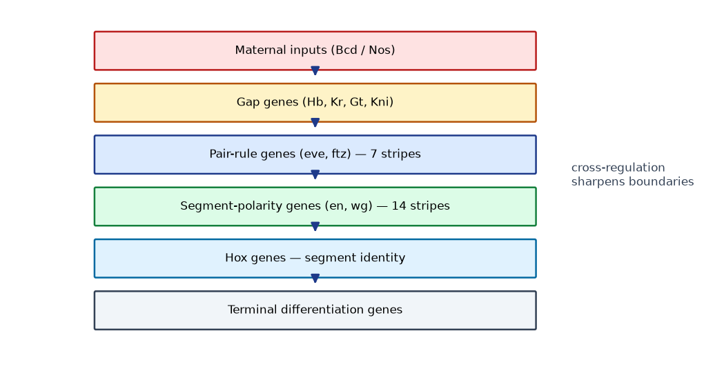
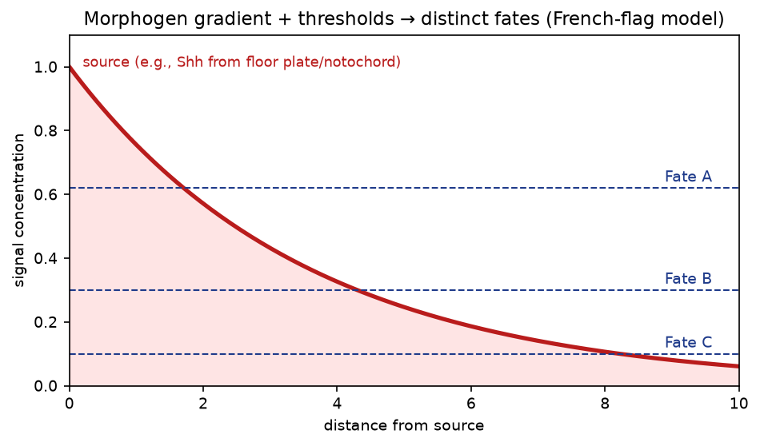
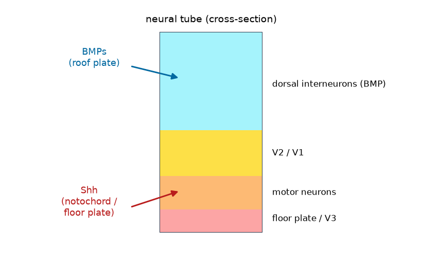
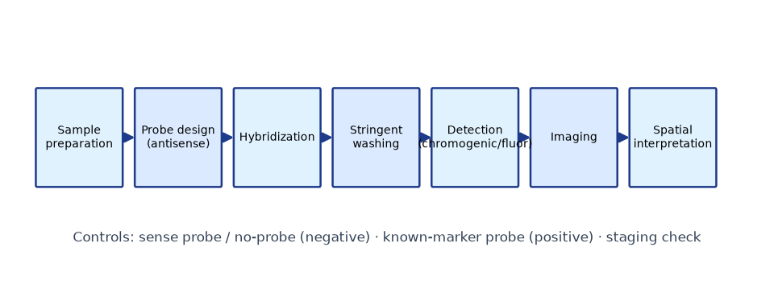
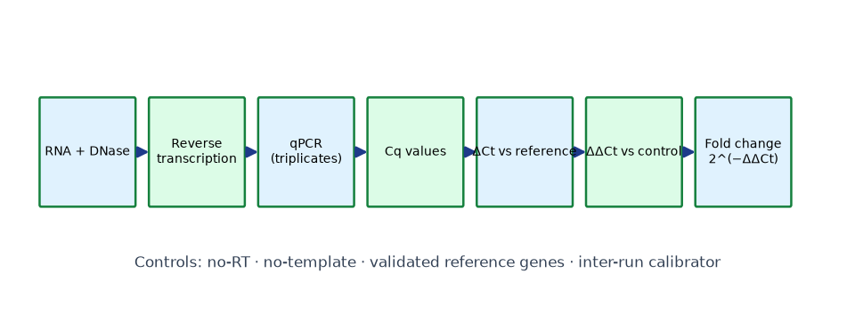

# Diagram gallery

All 21 programmatic teaching diagrams (matplotlib; regenerate with `DIAGRAMS/generate_diagrams.py`). Each is embedded in the relevant module and lab pages.

*Anatomy of a cloning plasmid: origin of replication, selectable marker, multiple cloning site, promoter and terminator.*

*Restriction-enzyme cloning: the insert and vector are cut with compatible enzymes, then ligated directionally.*

*The complete molecular-cloning workflow, from target-gene identification to sequence-confirmed recombinant construct.*

*Selection versus screening versus validation: antibiotic selection, colony PCR screening and sequencing validation.*

*Gibson Assembly: a 5' exonuclease chews back ends, complementary overlaps anneal, polymerase and ligase seal the seams.*

*Golden Gate (type IIS) assembly: enzymes cut outside their recognition sites, creating programmable 4-bp overhangs for one-pot multi-part assembly.*

*An expression cassette: promoter, translation-initiation context, open reading frame and terminator/polyadenylation signal.*

*Promoter-reporter, enhancer-reporter and fusion-reporter construct architectures.*

*Conceptual GMO generation workflows for bacteria, plants (Agrobacterium / biolistics) and animals.*

*CRISPR-Cas9 targeting: guide RNA directs Cas9 to the PAM-adjacent target, creating a double-strand break.*

*Base editing and prime editing modify DNA without a double-strand break.*

*A developmental gene-regulatory network cascade linking signaling, transcription factors and terminal target genes.*

*A morphogen gradient patterned by production, diffusion and decay; threshold concentrations specify distinct cell fates.*

*Spatial gene-expression domains in the vertebrate neural tube generated by opposing Shh and BMP gradients.*

*In situ hybridization workflow: probe design, hybridization, washing, detection and spatial interpretation.*

*RT-qPCR workflow from RNA isolation to the delta-delta-Ct relative-expression calculation.*

*Bulk RNA-seq workflow: library preparation, sequencing, alignment/quantification and differential expression.*

*Single-cell RNA-seq workflow: cell barcoding, library construction, clustering and cell-type annotation.*

*Spatial transcriptomics workflow: tissue sectioning, spatially barcoded capture, sequencing and spatial reconstruction.*

*In-silico spatial expression map used in the computational labs (region markers and gradients).*

*A simulated developmental expression heatmap (genes x stages) of the kind analyzed in the data labs.*
