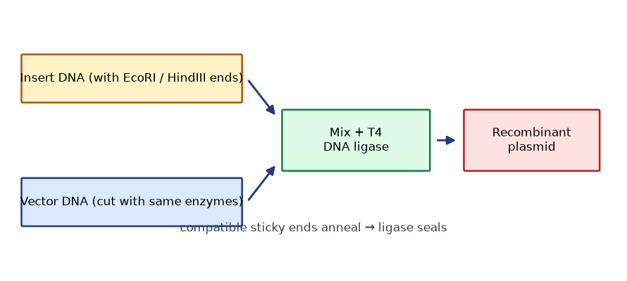

# Lab 02 — Restriction Digestion Analysis (Simulation)

**Type:** Simulation / Computational (uses provided data; optional wet-lab demonstration per institutional SOP) · **Duration:** 1 session (~3 h)
**Course:** GMOs, Cloning Techniques, and Developmental & Spatial Gene Expression

## 1. Learning objectives

1. Relate restriction-enzyme recognition/cut positions to fragment outcomes.
2. Build an in-silico digest and predict fragment sizes.
3. Interpret simulated gel images/migration data against a ladder.
4. Diagnose cloning outcomes (correct, empty, rearranged) from digest patterns.

## 2. Background

A diagnostic digest is the cheapest structural check of a plasmid: cut with enzymes whose sites flank the insert (or cut asymmetrically), run the fragments on an agarose gel, and compare observed sizes with the map prediction. Because migration ∝ log(length), sizing requires interpolation against a ladder.

## 3. Principle

- Enzymes cut at defined sequences (recognition sites) at defined positions (see Module 4).
- Fragment sizes depend on *positions* of sites, not just their presence.
- Comparing **predicted** to **observed** sizes validates (or falsifies) the assumed map.

## 4. Materials (simulation)

- `DATA/cloning-data/plasmid_sequences/*.fasta` — three candidate plasmids A, B, C (one correct, one empty vector, one rearranged)
- `DATA/cloning-data/gel_migration_ladder.csv` — ladder band sizes and migration distances
- `DATA/cloning-data/digest_band_positions.csv` — band positions for each digest lane (A, B, C × two enzyme pairs)
- `DATA/cloning-data/analyze_digest.py` — interpolation script
- Optional wet-lab demonstration: instructor-run digest of a teaching plasmid (follow institutional SOP; standard agarose-gel materials).

## 5. Equipment

Computer (Python 3); optional: teaching-lab gel apparatus (demonstration only).

## 6. Safety

Simulation: none. Wet-lab demonstration: follow institutional chemical/biological hygiene SOPs (SYBR-class stains, UV/blue-light handling) under instructor supervision.

## 7. Procedure / workflow

1. Read the plasmid maps (FASTA + annotation table).
2. Use `analyze_digest.py` (or any restriction tool) to compute fragment sizes for each enzyme pair on each plasmid.
3. Convert band *positions* to *sizes* using the ladder (log-interpolation).
4. Match observed to predicted; classify each plasmid as **correct / empty / rearranged**.
5. For the rearranged plasmid, propose a molecular explanation consistent with the pattern.

**Interpolation snippet:**

```python
import pandas as pd, numpy as np
lad = pd.read_csv("DATA/cloning-data/gel_migration_ladder.csv")
coef = np.polyfit(lad.migration_mm, np.log10(lad.size_bp), 1)
def size_from_pos(pos): return 10 ** np.polyval(coef, pos)
```

## 8. Expected results

| Lane | Observed sizes (≈) | Diagnosis |
|---|---|---|
| A digest 1 | 4.05 kb + 0.85 kb | correct construct |
| B digest 1 | 3.2 kb only | empty vector |
| C digest 1 | 2.3 + 1.7 + 0.9 kb | rearranged (e.g., partial duplication/inversion) |
| A digest 2 / B digest 2 / C digest 2 | consistent with diagnoses | |

*(Exact values in the CSVs; the workbook shows full reasoning.)*

## 9. Data table

| Plasmid | Enzyme pair | Predicted sizes | Observed sizes | Diagnosis |
|---|---|---|---|---|
| A | | | | |
| B | | | | |
| C | | | | |

## 10. Calculations

- Ladder interpolation (show the fit and one example conversion).
- Predicted vs observed error (%) for each band.

## 11. Interpretation

- Why does an *undigested* plasmid not give a single size band? (Supercoiled forms migrate anomalously.)
- Why use two enzyme pairs for a definitive call?

## 12. Troubleshooting

| Symptom | Likely cause | Fix |
|---|---|---|
| Smearing lanes | DNA degradation / overload | Clean prep; load less |
| Faint high-MW band | Partial digest | Fresh enzyme; check star activity |
| Bands "between" ladder | Normal — interpolate | — |

## 13. Post-lab questions

1. Why does a *linearized* empty vector sometimes appear larger than its map size?
2. Your correct-construct digest shows three bands, not two. What third site could explain it?
3. Why is log(size) linear in migration, not size itself?

## 14. Viva questions

1. Give one enzyme producing sticky ends and one producing blunt ends.
2. Why compare against a ladder rather than the well position?
3. What is star activity?

## Figures

<figure markdown>


*Figure - Restriction-enzyme cloning: the insert and vector are cut with compatible enzymes, then ligated directionally.*
</figure>


## 15. Instructor notes / answer key (summary)

- A = correct (expected fragments match design), B = empty vector, C = rearranged (duplication of a region — inferable because the sum of observed fragment sizes exceeds the plasmid map size).
- Wet-lab variant: use an instructor-prepared teaching plasmid with a single-insert design; run one-enzyme and two-enzyme digests to show the contrast.
- Full table in the [Workbook](../guide/workbook.md).

## 16. Advanced challenge

Design a *single-enzyme* digest strategy that still distinguishes orientation for the Lab-01 construct (hint: asymmetric sites around the insert), and explain when a single digest is insufficient.

---

**Related resources:** [Lab workbook](../guide/workbook.md) · [Cheat sheet](../guide/cheat-sheet.md) · [Datasets](../downloads/datasets.md) · [Assessments](../assessment/index.md)

[Course home](../index.md)
