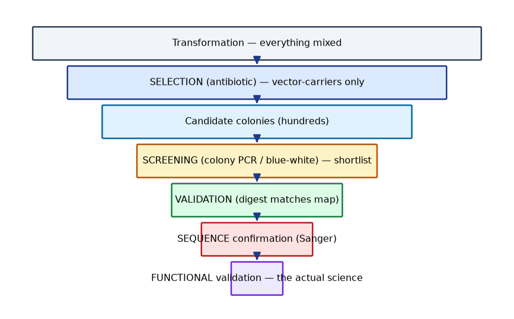

# Lab 04 — Colony PCR and Clone Screening (Simulation)

**Type:** Simulation / Computational · **Duration:** 1 session (~3 h)
**Course:** GMOs, Cloning Techniques, and Developmental & Spatial Gene Expression

## 1. Learning objectives

1. Design colony-PCR primers that distinguish empty vs insert-carrying vs wrong-orientation clones.
2. Interpret simulated colony-PCR band patterns.
3. Choose and interpret a diagnostic digest for the PCR-positive clones.
4. Explain what Sanger sequencing adds and design primer coverage across the construct.

## 2. Background

After transformation, *selection* (antibiotic) only says "has vector". *Screening* (colony PCR, blue-white) shortlists candidates; *validation* (digest, sequencing) proves structure. This lab walks that decision chain on simulated colonies from Lab 03's L2 condition.

## 3. Principle

- **Colony PCR:** primers flanking the MCS give a size-discriminating product; one vector + one insert primer forces orientation-specific readout.
- **Blue-white (this vector carries lacZα):** white colonies = insert-disrupted lacZα candidates; blue = empty vector.
- **Diagnostic digest:** structural check of mini-prep DNA (Lab 02 logic).
- **Sanger sequencing:** junction + internal coverage; final word on sequence identity.

## 4. Materials (simulation)

- `DATA/cloning-data/colony_pcr_results.csv` — 24 colonies × band sizes (two primer sets)
- `DATA/cloning-data/sanger_chromatogram_summary.txt` — synthetic trace descriptions (good, mixed, truncated)
- Primer sequences from Lab-01 design

## 5. Equipment

Computer (Python/pandas optional for tabulating patterns).

## 6. Safety

Simulation only.

## 7. Procedure / workflow

1. **Design two primer sets:**
   - Set A: vector-flanking (both primers in vector, outside MCS) — size distinguishes empty vs insert; cannot tell orientation.
   - Set B: vector-forward + insert-reverse — orientation-specific.
2. **Tabulate the 24 colonies** from the CSV: classify each as empty / correct / wrong-orientation / ambiguous / PCR-failure.
3. **Cross-check with the blue-white data** (the CSV includes the plate color): white+PCR-positive → candidate; blue+PCR-positive → beware (lacZα not disrupted — internal-site anomaly?); white+PCR-negative → re-run PCR.
4. **Choose mini-prep clones** (top 4) and predict their diagnostic-digest patterns.
5. **Plan Sanger coverage:** given vector primers bind 120 bp from the MCS, how many reads cover the 850 bp insert + junctions? Propose an internal primer if needed.

## 8. Expected results

| Pattern (Set A) | Pattern (Set B) | Diagnosis |
|---|---|---|
| ~1.05 kb | ~0.7 kb | correct orientation |
| ~1.05 kb | none | wrong orientation |
| ~0.2 kb | none | empty vector |
| none | none | PCR failure (re-run) |
| both A bands | mixed | mixed colony / indel — re-streak |

*(Simulated data will contain ~60–70% correct, plus deliberate failure modes.)*

## 9. Data table

| Colony | Plate color | Set A band | Set B band | Diagnosis | Next step |
|---|---|---|---|---|---|
| 1 | | | | | |
| … | | | | | |

## 10. Calculations

- Expected band sizes for Sets A and B from your Lab-01 map.
- Read coverage arithmetic for Sanger (read length ~700–900 bp assumption, stated).

## 11. Interpretation

- Why can Set A never resolve orientation?
- Why must a blue colony with a positive PCR be investigated rather than discarded silently?

## 12. Troubleshooting

| Symptom | Likely cause | Fix |
|---|---|---|
| All colonies PCR-negative | PCR setup error; too little colony template | Positive-control colony; fresh mix |
| Both bands in Set A | Mixed colony | Restreak single colony |
| Correct PCR but odd digest | PCR can't see structural changes | Trust the digest; sequence |

## 13. Post-lab questions

1. Why pick both white *and* blue colonies when troubleshooting the plate, rather than white only?
2. How many Sanger reads would definitively cover your 4.05 kb construct, and why?
3. A colony is PCR-positive in Set B but digest-negative. Which do you trust, and why?

## 14. Viva questions

1. Define screening vs selection (Module 3).
2. Why does lacZα complementation require a specific host strain?
3. What does a mixed Sanger trace (overlapping peaks) indicate?

## Figures

<figure markdown>

*Figure - Selection versus screening versus validation: antibiotic selection, colony PCR screening and sequencing validation.*
</figure>

## 15. Instructor notes / answer key (summary)

- The CSV deliberately includes: 14 correct, 4 empty, 2 wrong-orientation, 2 mixed, 2 PCR-failure colonies.
- Sanger coverage: two vector-primed reads (F and R) cover insert + junctions for this 850 bp insert; anything >1 kb needs an internal primer.
- Full walk-through in the [Workbook](../guide/workbook.md).

## 16. Advanced challenge

Design a screening pipeline that avoids Sanger sequencing entirely (restriction + PCR logic only), and state explicitly what residual risk it leaves (e.g., PCR-derived point mutations in the insert).

---

**Related resources:** [Lab workbook](../guide/workbook.md) · [Cheat sheet](../guide/cheat-sheet.md) · [Datasets](../downloads/datasets.md) · [Assessments](../assessment/index.md)

[Course home](../index.md)
