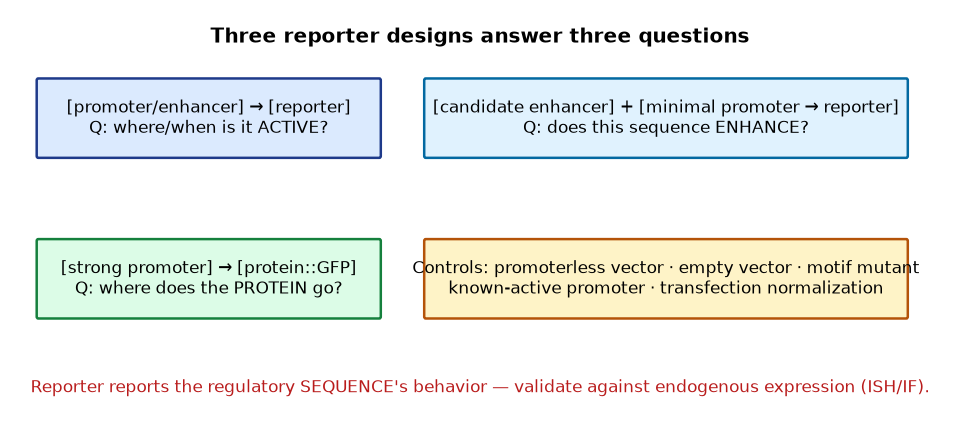

# Lab 06 — Reporter-Gene Analysis (Simulation + optional demonstration)

**Type:** Simulation (fluorescence/luminescence datasets); optional wet demonstration per SOP · **Duration:** 1 session (~3 h)
**Course:** GMOs, Cloning Techniques, and Developmental & Spatial Gene Expression

## 1. Learning objectives

1. Design promoter- and enhancer-reporter experiments with proper controls.
2. Interpret dual-luciferase data (Firefly normalized to Renilla).
3. Interpret fluorescence-microscopy reporter images (simulated).
4. Distinguish reporter output from endogenous-expression claims (validity limits).

## 2. Background

Reporters convert regulatory activity into measurable signal (Module 5). The design principles: promoter-reporters ask *when/where is this promoter active*; enhancer-reporters ask *does this sequence enhance, and where*; fusions ask *where does the protein go*. Each design has characteristic failure modes that controls are built to catch.

## 3. Principle

- **Dual luciferase:** Firefly luciferase under the test regulatory element; Renilla under a constitutive promoter as transfection/internal control; Firefly/Renilla ratio = normalized reporter activity.
- **Fluorescence reporters:** GFP intensity per cell/tissue region reports regulatory activity qualitatively–semiquantitatively; background subtraction and exposure control are essential.

## 4. Materials (simulation)

- `DATA/gene-expression-data/dual_luciferase.csv` — Firefly/Renilla raw values: test promoter (WT), test promoter (mutated motif), minimal-promoter-only, enhancer ± orientation, empty vector; n = 4
- `DATA/gene-expression-data/gfp_reporter_images_summary.csv` — simulated image-region intensities (notochord, somite, neural tube) for promoter-GFP constructs
- Python 3 or spreadsheet

## 5. Equipment

Computer (Python 3: pandas, matplotlib).

## 6. Safety

Simulation only. (A wet demonstration of luciferase assay readout in a plate reader may be run by instructors per institutional SOP — no student-operated transfection in the teaching setting.)

## 7. Procedure / workflow

1. **Compute normalized activities:** Firefly/Renilla per replicate; mean ± SD per construct.
2. **Statistical comparison:** WT promoter vs mutated motif; WT vs minimal-promoter-only (state test and n).
3. **Enhancer orientation analysis:** A-vs-B orientation of the enhancer — enhancers are orientation-flexible; interpret the result accordingly.
4. **Fluorescence region analysis:** background-subtract; compare GFP in notochord vs somite vs neural tube regions for the *shha*-promoter-GFP construct.
5. **Write the interpretation:** does the data support "the promoter drives notochord expression"? What is NOT proven?

## 8. Expected results (shape)

- WT promoter >> mutated motif (motif-dependent activity).
- WT >> minimal-promoter-only (promoter carries specific activity).
- Enhancer works in both orientations (within error) — the signature of enhancer behavior.
- GFP signal concentrated in the notochord region, matching the endogenous *shha* literature pattern.

## 9. Data table

| Construct | Normalized activity (mean ± SD) | vs WT |
|---|---|---|
| Promoter WT | | — |
| Promoter motif-mutant | | |
| Minimal promoter only | | |
| Enhancer + minimal (orient A) | | |
| Enhancer + minimal (orient B) | | |
| Empty vector | | |

## 10. Calculations

- Normalization arithmetic for one full row (raw → ratio → mean ± SD).
- Fold-activity WT vs minimal promoter.

## 11. Interpretation

- Why is Renilla normalization essential in transient transfection?
- What does the enhancer-orientation result *mechanistically* suggest?
- Why does promoter-GFP activity not prove the endogenous gene's spatial pattern? (Chromatin context, missing distal elements — Module 5/10.)

## 12. Troubleshooting (conceptual)

| Symptom | Likely cause | Fix |
|---|---|---|
| Renilla counts ~0 | Transfection failure or wrong substrate | Check co-transfection controls |
| Firefly saturated | Over-expression / exposure too long | Dilute lysate; shorten window |
| High empty-vector activity | Promoterless vector still active (cryptic element) | Re-design; use truly minimal backbone |

## 13. Post-lab questions

1. Design the minimal control set for a *new* enhancer candidate.
2. Your enhancer works in orientation A only. Propose a molecular explanation and a follow-up.
3. When would you add a destabilization tag to GFP, and what question does that change?

## 14. Viva questions

1. Compare fluorescence vs luminescence quantitation (Module 5 table).
2. Why mutate the motif rather than delete it?
3. Name one fusion-reporter artifact.

## Figures

<figure markdown>

*Figure - Promoter-reporter, enhancer-reporter and fusion-reporter construct architectures.*
</figure>

## 15. Instructor notes / answer key (summary)

- Motif mutation reduces activity ~80%; enhancer works both orientations (simulated data in CSV).
- Wet demonstration optional: instructor-run luciferase readout; students interpret provided raw counts.
- Full solution in the [Workbook](../guide/workbook.md).

## 16. Advanced challenge

Propose an experimental series that moves from "reporter active in notochord" to "enhancer *necessary* for endogenous expression" (CRISPRi or knockout of the endogenous element; ISH readout). State what each step adds.

---

**Related resources:** [Lab workbook](../guide/workbook.md) · [Cheat sheet](../guide/cheat-sheet.md) · [Datasets](../downloads/datasets.md) · [Assessments](../assessment/index.md)

[Course home](../index.md)
