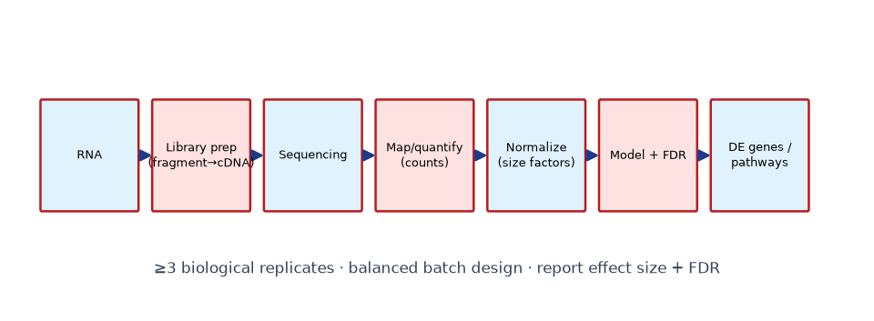
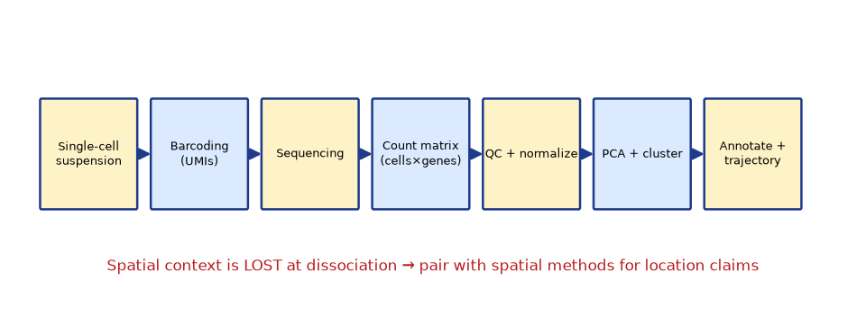
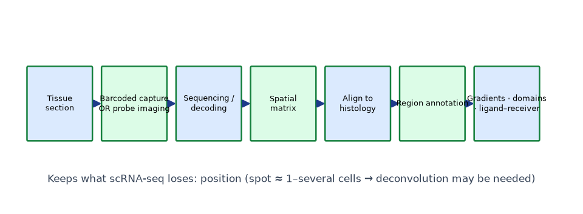

# Lab 08 — Computational Gene-Expression Analysis (RNA-seq / single-cell / spatial)

**Type:** Computational · **Duration:** 1–2 sessions (~4–6 h)
**Course:** GMOs, Cloning Techniques, and Developmental & Spatial Gene Expression

## 1. Learning objectives

1. Run the complete mini-workflows: bulk differential expression, single-cell clustering/annotation, spatial mapping.
2. Apply QC, normalization, dimensionality reduction, and clustering appropriately.
3. Annotate clusters with marker genes and interpret biological identity.
4. Produce publication-style figures (heatmap, PCA/UMAP-style plot, spatial map).

## 2. Background

Modern expression analysis is computational: count matrices in, biological conclusions out. This lab uses **small simulated datasets** (fully generated, labeled as teaching data) so every step is inspectable — the logic transfers to real pipelines (DESeq2/Seurat/Scanpy class) which students will meet in research settings.

## 3. Principle

- **Bulk:** normalize for library size → model counts (here: log-CPM + t-test; research: negative-binomial GLM) → FDR.
- **Single-cell:** QC (library size, gene count, doublets) → normalize → PCA → graph/k-means clustering → marker-gene annotation.
- **Spatial:** spot matrix + coordinates → region annotation → region-specific markers → gradient tests.

## 4. Materials

| File | Content |
|---|---|
| `DATA/gene-expression-data/rnaseq_counts.csv` | 500 genes × 6 samples (WT/KO × 3) |
| `DATA/gene-expression-data/metadata.csv` | sample sheet (condition, batch) |
| `DATA/gene-expression-data/single_cell_counts.csv` | 300 genes × 600 cells (3 latent types) |
| `DATA/gene-expression-data/cell_metadata.csv` | cell QC + latent label (instructor use) |
| `DATA/spatial-expression-data/spatial_matrix.csv` | 200 spots × 200 genes |
| `DATA/spatial-expression-data/spot_coordinates.csv` | x,y per spot |
| `DATA/spatial-expression-data/tissue_annotation.csv` | spot → region (instructor key) |
| `DATA/spatial-expression-data/analysis_demo.py` | starter script |

## 5. Equipment

Python 3 with numpy/pandas/matplotlib/scikit-learn (course venv).

## 6. Safety

Computational only.

## 7. Procedure / workflow

**Part A — bulk RNA-seq:**
1. Load counts + metadata; check batch × condition balance.
2. Filter low-count genes; log-CPM.
3. Compute log2FC (KO vs WT); t-test on log values; BH-FDR.
4. Volcano plot; list top 10 up/down.
5. Interpret: which genes are *plausibly* connected to the KO (provided gene list)?

**Part B — single-cell:**
1. QC: filter cells with library <500 UMIs or <200 detected genes.
2. Normalize (CPM) + log; PCA (top 2–10 PCs).
3. Cluster (k-means k=3 or graph-based); visualize on PC1/PC2.
4. Annotate clusters using markers (*pax6a* neural, *myod1* muscle, *hbbe1* blood).
5. Compute per-cluster mean expression of a developmental TF set; interpret trajectories.

**Part C — spatial:**
1. Join matrix + coordinates + annotation.
2. Region-mean expression; top marker per region.
3. Plot each marker across x,y (in-silico in situ).
4. Gradient test: correlate expression with distance-to-edge for one region.

## 8. Expected results (shape)

- Part A: KO down-regulates ~15–25 genes including a connected pathway; volcano plot separates them.
- Part B: three clusters annotate cleanly as neural/muscle/blood; one subcluster shows intermediate state (transition).
- Part C: markers localize to their regions; one gene shows a monotonic gradient toward the tissue edge.

## 9. Data tables

| Analysis | Metric | Result |
|---|---|---|
| Bulk | # genes FDR<0.05, \|log2FC\|>1 | |
| Single-cell | cluster sizes; marker max-z | |
| Spatial | top marker per region | |

## 10. Calculations

- Show the log2FC computation for the top gene.
- Show the QC filter arithmetic (cells kept/total).
- Show the gradient correlation (Pearson r, p).

## 11. Interpretation

- Why must batch not confound condition in Part A?
- What does the intermediate subcluster in Part B suggest biologically, and how would you test it?
- Why is the Part C gradient *hypothesis-generating* rather than conclusive?

## 12. Troubleshooting (computational)

| Symptom | Likely cause | Fix |
|---|---|---|
| PCA shows batch separation | Batch effect dominates | Check design; integrate/linear-model |
| One giant cluster | Over-aggressive QC or wrong k | Re-examine filters; try k via silhouette |
| Spatial map noise | Spots with tiny libraries | Filter low-library spots |

## 13. Post-lab questions

1. Why is dropout a bigger interpretive problem in scRNA-seq than bulk?
2. What claim can Part C make that Part B cannot — and vice versa?
3. Design the ISH experiment that would validate your Part C top gradient gene.

## 14. Viva questions

1. Define UMI and its purpose.
2. Why log-transform CPM before PCA/clustering?
3. What is deconvolution in array-based spatial data?

## Figures

<figure markdown>

*Figure - Bulk RNA-seq workflow: library preparation, sequencing, alignment/quantification and differential expression.*
</figure>

<figure markdown>

*Figure - Single-cell RNA-seq workflow: cell barcoding, library construction, clustering and cell-type annotation.*
</figure>

<figure markdown>

*Figure - Spatial transcriptomics workflow: tissue sectioning, spatially barcoded capture, sequencing and spatial reconstruction.*
</figure>

## 15. Instructor notes / answer key (summary)

- Part A expected: 18 genes FDR<0.05 & |log2FC|>1 (simulated).
- Part B: clusters 1/2/3 ≈ neural/muscle/blood with sizes ~220/210/170; transition subcluster detectable at k=4.
- Part C: region markers as designed in the generator script; edge-gradient gene r ≈ −0.6 (edge-high).
- Starter script + keys: `analysis_demo.py`; full solutions in the [Workbook](../guide/workbook.md).

## 16. Advanced challenge

Implement a simple RNA-velocity-*style* directionality argument: given spliced/unspliced-like columns in the single-cell data, order clusters and state the developmental trajectory. Note the assumptions your mini-version makes.

---

**Related resources:** [Lab workbook](../guide/workbook.md) · [Cheat sheet](../guide/cheat-sheet.md) · [Datasets](../downloads/datasets.md) · [Assessments](../assessment/index.md)

[Course home](../index.md)
