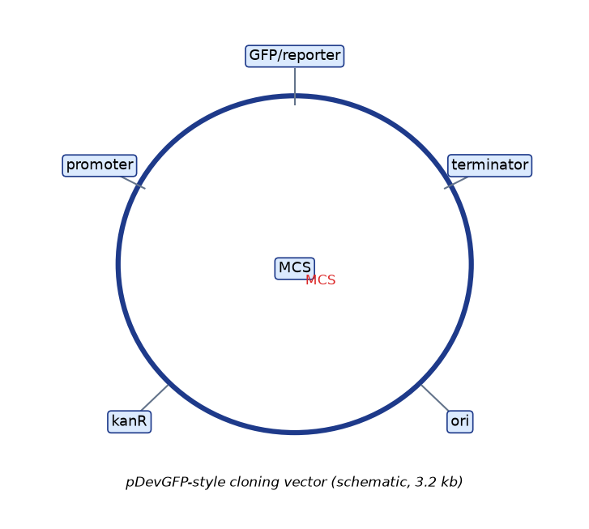
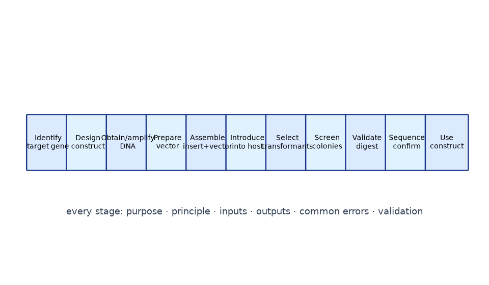

# Module 2 — DNA and Molecular Cloning Fundamentals

**Level:** Beginner → Intermediate

---

## Learning objectives

1. Define every structural element of a plasmid cloning vector and explain what breaks when it is missing.
2. Distinguish insert, backbone, multiple cloning site, expression cassette, and fusion constructs.
3. Walk the eleven-stage molecular-cloning workflow and, for each stage, state its purpose, inputs, outputs, typical failure modes, and validation.
4. Read a plasmid map confidently.

---

## 1. The parts of a cloning project

Molecular cloning always has two DNA partners:

- The **insert** (also: passenger, target fragment) — the DNA you want to propagate, express, or study.
- The **vector** — a self-replicating DNA vehicle that will carry the insert inside a host cell. Everything on the vector except the cloning site is the **backbone**.

A vector is not merely "a circle with a hole in it". Every component has a job:

| Component | Job | Consequence if absent/defective |
|---|---|---|
| **Origin of replication (ori)** | Host replication machinery initiates here; copy number is largely set by the ori (e.g., pUC/pMB1-derived high-copy ~500–700, pBR322-derived ~15–20, pSC101-derived low-copy ~5, F-derived single-copy BACs) | No propagation; or runaway/insufficient copy number |
| **Selectable marker** | Allows *only* cells carrying the vector to survive (most commonly antibiotic resistance: ampR, kanR, camR, tetR, specR) | Cannot distinguish transformed from untransformed cells |
| **Multiple cloning site (MCS)** | Cluster of unique restriction sites for inserting DNA | Insertion impossible or unidirectional errors common |
| **Promoter** | Drives transcription of the insert (in expression vectors) or of a reporter | Clone exists but is never transcribed |
| **Ribosome-binding site / translation-initiation context** | Positions the ribosome (prokaryotes: Shine–Dalgarno; eukaryotes: Kozak context) | Transcript made, no protein |
| **Terminator** | Stops transcription at a defined point | Read-through transcription destabilizes constructs |
| **Reporter gene** | Quantifiable/visible output (GFP, lacZ, luciferase) | Expression invisible |
| **Tag/fusion elements** (His₆, FLAG, HA, GST, fluorescent proteins) | Detection or purification of the protein product | Protein made but hard to detect/purify |

**Copy number rule of thumb:** high-copy vectors give lots of DNA (good for plasmid prep) but can be burdensome or toxic to the host when expressing proteins; low-copy vectors are gentler and better for unstable or large inserts.

```text
            ┌──────────────── plasmid (ds circular DNA) ────────────────┐
            │                                                          │
            │        ┌── selectable marker (e.g., ampR) ──┐            │
            │        │                                    │            │
            │   ┌────┴────┐                          ┌────┴────┐       │
            │   │   ori   │                          │ promoter│       │
            │   └─────────┘                          └────┬────┘       │
            │                                             ▼            │
            │   ┌──────────────────┐        ┌──────────────────┐       │
            │   │  MCS / cloning   │◀───────│   gene of interest      │
            │   │      site        │        │   or reporter           │
            │   └──────────────────┘        └──────────────────┘       │
            │                                                          │
            └──────────────────────────────────────────────────────────┘
```

*Figure 2.1 — Plasmid architecture (schematic). A real map lists sizes, positions and orientations of every element.*

### 1.1 Expression cassette

An **expression cassette** is the complete transcriptional unit for one expressed sequence: **promoter → 5′ regulatory elements → coding sequence (± tags) → terminator/polyA signal**. Vectors may carry one cassette or several. When people say "the construct", they usually mean the vector with a complete expression cassette plus insert.

### 1.2 Fusion proteins

If the insert is cloned **in-frame** with a tag or reporter coding sequence, translation produces a single polypeptide — a **fusion protein** (e.g., GFP-fusion, His-tagged enzyme, lacZ-fusion). Design considerations:

- **Reading frame:** the insert must join the tag without frameshift.
- **Linker:** flexible linkers (e.g., Gly–Ser repeats) preserve independent folding of both parts.
- **Termini matter:** N-terminal fusions need the tag's start codon to dominate; C-terminal fusions must not introduce a premature stop codon before the tag.
- **Function risk:** a fusion can alter the fused protein's localization or activity — always interpret with a control.

---

## 2. The complete molecular-cloning workflow

```text
Identify target gene → Design construct → Obtain/amplify DNA → Prepare vector
→ Assemble insert+vector → Introduce into host → Select transformants
→ Screen colonies → Validate construct → Sequence confirmation → Use construct
```

For each stage: **purpose → principle → inputs → outputs → common errors → validation**.

### Stage 1 — Identify target gene

- **Purpose:** choose the DNA to work with.
- **Principle:** the gene exists in a reference genome/transcriptome database (NCBI, Ensembl).
- **Inputs:** biological question; database record.
- **Outputs:** chosen coding sequence or regulatory region; accession numbers recorded.
- **Common errors:** wrong isoform (alternative splicing); wrong species strain; confusing gene symbol orthologues across species.
- **Validation:** cross-check nucleotide vs protein record; BLAST to confirm identity.

### Stage 2 — Design construct

- **Purpose:** decide exactly what the final plasmid looks like before touching a pipette.
- **Principle:** construct design determines everything downstream — enzyme choice, primers, expression behavior.
- **Inputs:** target sequence; vector maps; cloning software (e.g., SnapGene, Benchling, ApE — *examples, not endorsements*).
- **Outputs:** annotated construct map; primer sequences; assembly plan.
- **Common errors:** illegal sites (restriction site inside insert when using restriction cloning); wrong reading frame; missing stop codon for C-terminal tag; promoter incompatible with host.
- **Validation:** in-silico simulation of the whole assembly before ordering anything.

### Stage 3 — Obtain/amplify DNA

- **Purpose:** get physical DNA molecules: insert and vector.
- **Principle:** PCR amplifies the insert from template (cDNA, genomic DNA, another plasmid) with primers that add any needed ends; vectors come from plasmid preps or commercial sources.
- **Inputs:** template DNA; primers; polymerase; vector stock.
- **Outputs:** purified PCR product; digested/prepared vector.
- **Common errors:** primer-dimers; wrong annealing temperature; mutations introduced by high-cycle PCR (use high-fidelity polymerase for cloning); contamination.
- **Validation:** agarose gel — a single band of expected size.

### Stage 4 — Prepare vector

- **Purpose:** open or linearize the vector so it can accept the insert; or provide compatible/overlapping ends.
- **Principle:** restriction digestion, PCR linearization, or dephosphorylation (see Module 4).
- **Inputs:** vector DNA; enzymes.
- **Outputs:** linearized/processed vector, gel-purified.
- **Common errors:** incomplete digestion; self-ligation background; small excised fragment not removed and then re-ligating.
- **Validation:** gel — clean linear band of correct size; negative control ligation (vector alone).

### Stage 5 — Assemble insert + vector

- **Purpose:** join insert and vector into a recombinant molecule in vitro.
- **Principle:** depends on method — ligase-mediated (restriction/TA/blunt), exonuclease-based (Gibson), type IIS (Golden Gate), recombinase (Gateway). Module 4 covers each.
- **Inputs:** insert; vector; assembly enzymes/conditions.
- **Outputs:** mixture containing the desired recombinant product among side products.
- **Common errors:** wrong molar ratios; incompatible ends; degraded enzyme mix.
- **Validation:** none at this stage — a plate-to-plasmid process; validate later.

### Stage 6 — Introduce into host

- **Purpose:** put recombinant DNA into cells that will amplify it.
- **Principle:** chemical transformation (competent *E. coli* + heat shock) or electroporation; other hosts need transfection/infection (Module 6).
- **Inputs:** assembly product; competent cells.
- **Outputs:** cells carrying a mixture of recombinant and background plasmids.
- **Common errors:** cells not actually competent (old stock, wrong buffer); DNA dirty (salt kills electroporation).
- **Validation:** positive-control transformation (known plasmid) and negative control (no DNA).

### Stage 7 — Select transformants

- **Purpose:** let only vector-carrying cells form colonies.
- **Principle:** plate on the antibiotic matching the vector marker; untransformed cells die/fail to grow.
- **Inputs:** transformed cells; selective plates.
- **Outputs:** colonies — candidates, not confirmations.
- **Common errors:** wrong antibiotic; plates older than the marker tolerates; using too much/too little plasmid for electroporation (arcing).
- **Validation:** compare colony number on positive vs negative control plates.

### Stage 8 — Screen colonies

- **Purpose:** distinguish colonies carrying the *desired recombinant* from those carrying empty vector or by-products.
- **Principle:** colony PCR across the insertion site; blue-white screening; restriction mini-prep digest; fluorescence if the insert carries a reporter.
- **Inputs:** colonies.
- **Outputs:** shortlist of candidate clones.
- **Common errors:** screening too few colonies; PCR design that cannot distinguish insert orientation.
- **Validation:** include both a positive-insert-size band expectation and an empty-vector expectation.

### Stage 9 — Validate construct

- **Purpose:** confirm structure by restriction analysis (mini-prep DNA cut with diagnostic enzymes gives a predicted band pattern).
- **Principle:** the map predicts fragment sizes; the gel either matches or it does not.
- **Inputs:** mini-prep DNA.
- **Outputs:** verified-by-digest clones.
- **Common errors:** choosing enzymes that give an uninformative pattern (one band).
- **Validation:** pattern matches in-silico digest.

### Stage 10 — Sequence confirmation

- **Purpose:** read the actual nucleotide sequence of the junctions/insert — the gold standard.
- **Principle:** Sanger sequencing from vector-priming sites and internal primers.
- **Inputs:** plasmid DNA; sequencing primers.
- **Outputs:** chromatograms and assembled sequence.
- **Common errors:** single-primer coverage (missed mutations elsewhere); not checking the *reverse* strand through the junctions.
- **Validation:** assembled contig matches design exactly, including frame and junctions.

### Stage 11 — Use the recombinant construct

- **Purpose:** the actual science — expression, transfection, transformation into a new host, reporting, editing.
- **Principle:** the validated plasmid becomes the reagent.
- **Inputs:** sequence-confirmed plasmid.
- **Outputs:** data, protein, or engineered cells/organisms.
- **Common errors:** assuming expression without testing; forgetting to re-sequence after long-term passaging of strains.
- **Validation:** expression/functional assays appropriate to the purpose (Module 5 onward).

---

## 3. Reading a plasmid map

Checklist for any map you are handed:

1. **ori** and copy number class.
2. **Selectable marker(s)** — and whether they differ between bacterial and mammalian parts of the vector (shuttle vectors, Module 3).
3. **MCS or assembly scar architecture** — which sites are unique?
4. **Promoter(s)** and their direction (arrow).
5. **Insert position and orientation** — is orientation marked?
6. **Total size** — expected band on a gel after a single-cutter digest.
7. **Priming sites** — where can sequencing primers bind?

> **Exam tip:** A map without orientation arrows is ambiguous; always state orientation explicitly when describing a construct ("insert in the same orientation as the promoter").

---

## Figures

<figure markdown>


*Figure - Anatomy of a cloning plasmid: origin of replication, selectable marker, multiple cloning site, promoter and terminator.*
</figure>

<figure markdown>


*Figure - The complete molecular-cloning workflow, from target-gene identification to sequence-confirmed recombinant construct.*
</figure>


## 4. Self-check questions

1. Which plasmid component would you modify to (a) increase plasmid yield from a mini-prep, (b) reduce burden on host cells expressing a toxic protein, (c) allow selection in both *E. coli* and yeast?
2. Why is a colony on a selective plate a *candidate* and not a *confirmed* clone?
3. Design-stage error: you plan restriction cloning into an MCS but the insert contains an internal EcoRI site. What are your options?
4. What information does Sanger sequencing add beyond a correct restriction-digest pattern?
5. Sketch (from memory) a plasmid containing: high-copy ori, kanR, T7 promoter, His₆ tag, TEV site, GOI, T7 terminator. Label sizes roughly.
---

## What you should know

Review the learning objectives at the top of this module and the self-check or quick-check questions above. When you can meet every objective unaided, you are ready to continue.

## What you should be able to do

- Test yourself with the [multiple-choice questions](../assessment/MCQs.md) and the [short-answer](../assessment/Short-Questions.md) and [long-answer](../assessment/Long-Questions.md) questions for these topics.
- Instructors: model answers are in the [answer key](../assessment/Answer-Key.md).
- Quick revision: [cheat sheet](../guide/cheat-sheet.md) and [FAQs](../guide/faqs.md).
- Hands-on practice: the [laboratory overview](../labs/index.md).

[<- Introduction to Genetic Engineering](../modules/01-Introduction-to-Genetic-Engineering.md) &middot; [Course home](../index.md) &middot; [Continue to next module ->](../modules/03-Cloning-Vectors-and-Selection.md)
