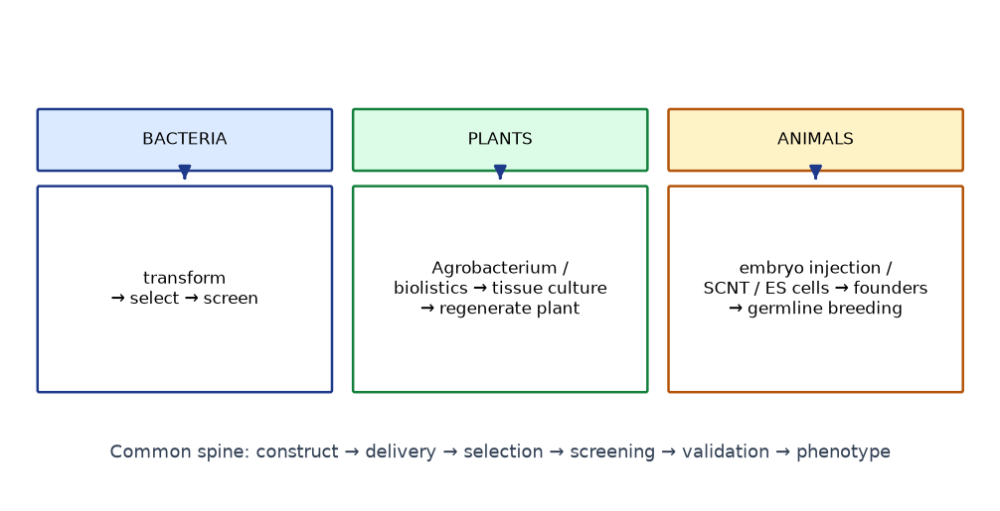

# Module 6 — GMO Generation

**Level:** Intermediate → Advanced

**Safety note:** this module describes *conceptual workflows* only. All procedures involving GMOs, animals, or regulated biological systems must follow institutional biosafety-committee (IBC/ETH) approval, containment rules, and instructor-approved SOPs. This course deliberately omits operational animal- and plant-manipulation parameters.

---

## Learning objectives

1. Define GMO, transgenic, gene-edited, stable vs transient modification with precision (Module 1 recap in applied form).
2. Describe the conceptual workflow for generating genetically modified bacteria, plants, and animals.
3. Distinguish historically important GMOs from current-generation products and research tools.
4. Connect GMO generation to the cloning modules: every GMO begins with a construct.

---

## 1. Foundations — what makes an organism "modified"?

An organism counts as genetically modified when laboratory methods have altered its genetic material in a defined, designed way. Sub-types:

| Category | Example | Defining feature |
|---|---|---|
| Transgenic | Bt cotton carrying bacterial *cry* genes | Foreign (cross-species) DNA |
| Cisgenic | Potato with late-blight resistance gene from a wild potato cross | Same-species DNA |
| Gene-edited | Herbicide-tolerance allele edited by base editing | Targeted edit, may add no foreign DNA |
| Knockout | *apoE*⁻/⁻ mouse (atherosclerosis model) | Gene inactivated |
| Reporter organism | GFP zebrafish, Brainbow mouse | Visible marker introduced |
| Transiently modified | Plasmid-transfected HEK293 cells | Expression without integration |

**Stable vs transient (research context):** transfection of a plasmid into cultured cells gives transient expression (days); selection with a mammalian marker (e.g., puromycin) and/or integration yields a **stable line**. In embryos, injected editing reagents act transiently but the *edit* can be inherited — a distinction that confuses many students: **the reagent is transient; the consequence is stable.**

---

## 2. Microorganisms

### 2.1 Conceptual workflow (bacterial genetic modification)

```text
Construct DNA (Modules 2–5)
      ↓
Introduce DNA (chemical transformation / electroporation / conjugation)
      ↓
Select transformants (antibiotic or auxotrophic marker)
      ↓
Screen (colony PCR, blue-white, reporter signal)
      ↓
Validate (diagnostic digest → sequencing → expression check)
      ↓
Characterize phenotype (growth, production titer, resistance, reporter)
```

### 2.2 Applications

- **Recombinant pharmaceutical proteins:** human insulin (Humulin, approved 1982 — first rDNA drug), growth hormone, factor VIII, erythropoietin (CHO cells rather than bacteria for glycoproteins).
- **Industrial enzymes:** amylases, proteases, lipases for detergents/food; rennet (chymosin) for cheese.
- **Research microbes:** expression strains, knockouts, biosensors.

### 2.3 Historical vs current

- **Historic milestone:** 1973 Cohen–Boyer recombinant plasmids; 1982 insulin approval.
- **Current:** engineered *E. coli*/yeast producing artemisinic acid (semi-synthetic artemisinin pathway), bio-based materials (e.g., bio-produced 1,3-propanediol), designed biosensors, minimal-genome organisms.

---

## 3. Plants

### 3.1 Conceptual workflow

```text
Identify trait + gene
      ↓
Build construct (cloning modules) — often binary vector for Agrobacterium
      ↓
Introduce DNA:
   • Agrobacterium-mediated transfer (most dicots, some monocots)
   • Biolistics / gene gun (DNA-coated particles)
      ↓
Tissue culture & regeneration (callus → shoots → roots → plant)
      ↓
Selection (plant-selectable marker: hpt/nptII/bar; or reporter)
      ↓
Molecular confirmation (PCR, Southern-type confirmation of integration,
   copy number, expression RT-qPCR/protein assays)
      ↓
Phenotypic & agronomic characterization (greenhouse → field trials under permit)
      ↓
Regulatory review (varies by country)
```

### 3.2 Agrobacterium-mediated transformation (conceptual)

- *Agrobacterium tumefaciens* naturally transfers a segment of its **Ti plasmid** — the **T-DNA**, flanked by 25-bp **border repeats** — into plant cells; integration into the plant genome.
- Engineering removes oncogenes from T-DNA ("disarmed" systems) and puts the desired cassette between the borders; **vir** genes (on helper plasmid or chromosome) mediate transfer.
- Binary-vector system: *E. coli*-friendly build plasmid + *Agrobacterium* helper functions.
- **Why plants are special:** any adult plant cell can, in principle, regenerate a whole plant (totipotency) — the engineered cell becomes an engineered organism through tissue culture.

### 3.3 Biolistic transformation (conceptual)

DNA-coated gold/tungsten particles physically delivered into cells; used for species/cultivars recalcitrant to *Agrobacterium* (e.g., some cereals) and for chloroplast transformation. Tends to give multiple-copy insertions.

### 3.4 Landmark crops (historically important → present)

| Crop | Modification | Mechanism | Status/notes |
|---|---|---|---|
| **Bt cotton / corn / brinjal** | *cry* genes from *Bacillus thuringiensis* | Insecticidal Cry proteins active in specific insect gut pH/conditions | First commercialized 1996 (US); transformed pest control economics; resistance evolution documented in some pest populations → managed as part of IPM (refuge strategies, pyramided traits) |
| **Herbicide-tolerant soybean/corn** | CP4 EPSPS (glyphosate tolerance) or pat/bar (glufosinate) | Altered target enzyme insensitive to herbicide | Dominant traits since 1996; weed-resistance issues drove herbicide mixtures and new tolerance traits |
| **PRSV-resistant papaya** ('Rainbow') | Viral coat-protein gene | Pathogen-derived resistance | Saved Hawaiian papaya industry after 1990s PRSV epidemic; classic public-sector GMO |
| **Golden Rice** | Phytoene synthase (*psy*) + carotene desaturase (*crtI*) | β-carotene biosynthesis in endosperm | Proof-of-concept 2000 (Ye et al.); GR2E received food-safety approvals (Philippines 2021, among others); nutrition-focused, public-sector, ongoing deployment debates |
| **Gene-edited crops** | e.g., high-oleic soybean (Calyno), non-browning mushroom (US) | Targeted knockouts/edits | Regulatory status varies by country; some (US mushroom) bypassed USDA oversight historically |

*(Statuses change; the science of each mechanism is stable, the regulatory landscape is not. Cite current sources when writing about commercial status.)*

---

## 4. Animals

### 4.1 Conceptual workflow

```text
Design construct or editing strategy
      ↓
Embryo manipulation or stem-cell route
   • pronuclear microinjection (classic transgenesis)
   • ES-cell chimera (mouse classics)
   • cytoplasmic injection of editing reagents (current CRISPR era)
   • SCNT (somatic-cell nuclear transfer — Dolly route)
      ↓
Embryo transfer to surrogate
      ↓
Founder identification (PCR/sequencing for transgene or edit)
      ↓
Breeding to establish lines; germline transmission confirmed
      ↓
Phenotyping under animal-care approval
```

**This course intentionally provides no operational parameters** (injection timing, hormone regimens, surgical details) — these depend on species, jurisdiction, and animal-care protocols.

### 4.2 Landmark animals

| Organism | Milestone | Year(s) | Significance |
|---|---|---|---|
| Mouse | Pronuclear transgenesis ("supermouse", Gordon & Ruddle; Palmiter/Brinster GH mouse) | 1981–82 | First routine mammalian transgenesis |
| Mouse | Embryonic-stem-cell knockouts (Capecchi, Smithies, Evans) | 1980s–89 | Targeted gene replacement; Nobel 2007 |
| Sheep | Dolly — SCNT from adult somatic cell | 1996 (pub. 1997) | Cloning ≠ transgenesis; nuclear reprogramming in vivo |
| Zebrafish | Tol2/transposon transgenesis; CRISPR F0 screening | 2000s–2010s | Vertebrate developmental genetics at scale |
| Various | GFP reporters (worm, fly, zebrafish, mouse) | 1994→ | Live developmental imaging |
| Goat/rabbit/chicken | Biopharming (e.g., antithrombin in goat milk, ATRYN approved 2006/2009) | 2000s | Transgenic animals as protein factories |
| Pig | α-1,3-galactosyltransferase knockout (xenotransplantation research); GalSafe pig (FDA approval 2020) | 2000s–2020 | Organ-source research |
| Dog/cat/fish | Decorative/companion transgenics (GloFish) | 2003→ | Public engagement; regulatory variations |

### 4.3 The cloning–transgenesis distinction

- **Reproductive cloning (SCNT)** copies an existing genome into an embryo — no new DNA designed.
- **Transgenesis** adds designed DNA, usually via embryos or cells.
- They combine: a transgenic somatic cell line can be the nuclear donor for SCNT (how many transgenic livestock were made before CRISPR-era embryo editing).

---

## 5. Cross-kingdom comparison

| Axis | Bacteria | Plants | Animals |
|---|---|---|---|
| DNA delivery | Transformation/electroporation | Agrobacterium / biolistics | Microinjection / viral / SCNT / stem cells |
| From modified cell to organism | Colony = organism | Totipotent regeneration | Embryo development / chimeras |
| Time to animal/plant | Overnight–days | Months (tissue culture) | Weeks–months + breeding |
| Copy number / insertion control | Plasmid-defined | Variable insertions (or targeted edits) | Random (classic) vs targeted (editing era) |
| Selection system | Antibiotic/auxotrophy | Plant markers + regeneration | Drug selection (cells) / genotyping (animals) |
| Regulatory burden | Containment (BSL) | Field-trial permits | Animal-care + biosafety + permits |

---

## Figures

<figure markdown>


*Figure - Conceptual GMO generation workflows for bacteria, plants (Agrobacterium / biolistics) and animals.*
</figure>


## 6. Self-check questions

1. Why does totipotency make plant transformation conceptually simpler than animal transgenesis?
2. A CRISPR injection creates an edit in some embryonic cells but not others. What is this called, and what does it mean for founder characterization?
3. Why did Bt crops make *refuge* strategies part of their deployment?
4. Distinguish SCNT from transgenesis using Dolly vs a GFP mouse as your examples.
5. Trace any one plant GMO from Module 6 back to the cloning modules: which construct elements were needed?
---

## What you should know

Review the learning objectives at the top of this module and the self-check or quick-check questions above. When you can meet every objective unaided, you are ready to continue.

## What you should be able to do

- Test yourself with the [multiple-choice questions](../assessment/MCQs.md) and the [short-answer](../assessment/Short-Questions.md) and [long-answer](../assessment/Long-Questions.md) questions for these topics.
- Instructors: model answers are in the [answer key](../assessment/Answer-Key.md).
- Quick revision: [cheat sheet](../guide/cheat-sheet.md) and [FAQs](../guide/faqs.md).
- Hands-on practice: the [laboratory overview](../labs/index.md).

[<- Expression Constructs and Reporter Genes](../modules/05-Expression-Constructs-and-Reporter-Genes.md) &middot; [Course home](../index.md) &middot; [Continue to next module ->](../modules/07-Genome-Editing-and-CRISPR.md)
