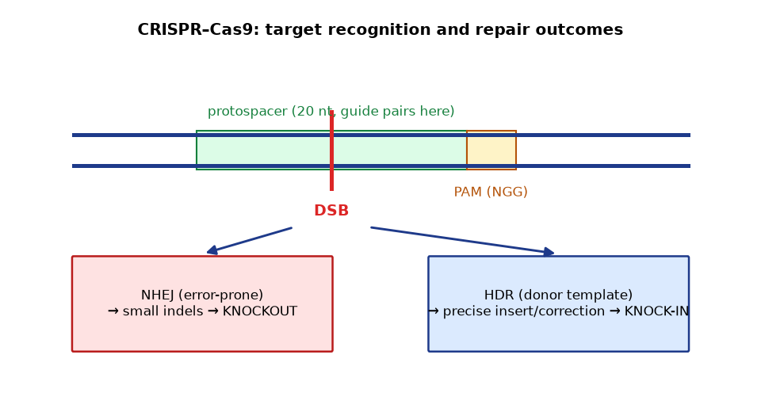
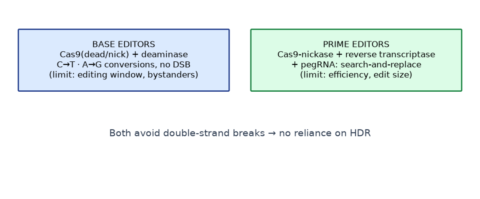

# Module 7 — Genome Editing and CRISPR

**Level:** Intermediate → Advanced

---

## Learning objectives

1. Explain CRISPR–Cas9 target recognition: guide RNA, PAM, R-loop formation, cleavage.
2. Distinguish NHEJ- and HDR-based outcomes, and base/prime editing from nuclease editing.
3. Compare traditional transgenesis with genome editing honestly — advantages *and* limitations.
4. Explain off-target effects, mosaicism, genotyping, and validation at a research-literacy level.

---

## 1. The CRISPR concept

CRISPR (Clustered Regularly Interspaced Short Palindromic Repeats) and *cas* genes form adaptive immune systems in bacteria and archaea: spacer sequences memorize past phage/plasmid invaders; Cas nucleases use RNA guides derived from those spacers to cut matching invading DNA.

The laboratory adaptation: **a programmable single-guide RNA (sgRNA)** — a ~20-nt guide segment fused to a Cas9-binding scaffold — directs **Cas9** to any genomic site adjacent to a matching **PAM** (protospacer-adjacent motif; for *S. pyogenes* Cas9, 5′-NGG-3′).

```text
   genomic DNA:   …  N  N  N  N  N  N  N  N  N  N  N  N  N  N  N  N  N  N  N  N   N  G  G  …
                              ▲20-nt protospacer▲            ▲PAM▲
                                     ║  base-pairing (R-loop)
   sgRNA:                            ═══════════════════════
                                     │
                                Cas9 nuclease domains
                                     │
                             blunt DSB ~3 bp upstream of PAM
```

*Figure 7.1 — Target recognition. The PAM is required for initiation; guide–target complementarity drives R-loop formation; HNH and RuvC-like domains cut the two strands.*

### 1.1 Cas protein toolbox (conceptual)

| System | PAM | Cut/output | Notes |
|---|---|---|---|
| SpCas9 (*S. pyogenes*) | NGG | Blunt DSB | Workhorse |
| SaCas9 | NNGRRT | Blunt DSB | Smaller — AAV-packaging friendly |
| Cas12a (Cpf1) | TTTV | Staggered DSB; its own crRNA processing | Multiplexing from one transcript |
| Cas13 | RNA targets (no PAM) | RNA knockdown | RNA editing/knockdown without DNA change |
| dCas9 (dead) | any (with sgRNA) | No cleavage | DNA-binding chassis for CRISPRa/i, imaging |
| Base editors (dCas9/FokI-free, deaminase fusions) | varies | C→T or A→G conversions | No DSB required |
| Prime editors (Cas9 nickase + reverse transcriptase) | varies | Small insertions/deletions/all base changes via pegRNA | Search-and-replace without DSB/donor template |

---

## 2. What happens after the cut — repair pathways

A **double-strand break (DSB)** is the sensor that triggers repair. The cell's repair machinery determines the edit:

```text
                        DSB
              ┌──────────┴──────────┐
              ▼                     ▼
           NHEJ                  HDR
  (non-homologous end      (homology-directed repair,
   joining; active           uses a donor template;
   throughout the cell       most active in S/G2)
   cycle)
              │                     │
   indels (small ins/del)     precise sequence from donor
   frameshifts → knockout     → knock-in, correction
```

- **Knockout:** NHEJ indels in an early coding exon → frameshift → premature stop → functional null (note: in-frame indels can escape; multiple sgRNAs or exon deletion improve success).
- **Knock-in:** HDR with a donor (ssODN for small edits; longer templates for tags/full genes). HDR is *inefficient* in many primary cells — a core limitation; small-molecule and cell-cycle tricks are active research/protocol areas.
- **NHEJ-based knock-in alternatives:** homology-independent targeted integration (HITI), NHEJ-mediated tag insertion with sgRNAs flanking both donor and locus.

### 2.1 Base editing and prime editing

- **Base editors** (Komor et al., 2016; Gaudelli et al., 2017): catalytically impaired Cas9 + deaminase (APOBEC/rADAR families) ± glycosylase inhibitor → single-base conversions (C→T, A→G; expanded lineages for other pairs) in a small editing window, **without a DSB**. Limits: editing window position, bystander bases, off-target deamination.
- **Prime editing** (Anzalone et al., 2019): Cas9(H840A) nickase fused to reverse transcriptase, guided by a **pegRNA** that encodes the intended edit; nicks one strand, reverse-transcribes the edit in. Handles all 12 base-to-base changes plus small insertions/deletions without donor templates. Limits: efficiency is cell-type/locus dependent; large edits remain hard.

---

## 3. Traditional transgenesis vs genome editing

| Axis | Traditional transgenesis | Genome editing |
|---|---|---|
| What is added | Foreign construct (± regulatory DNA), often at random loci | Change to an endogenous sequence; often no foreign DNA remains |
| Where it lands | Insertion site largely random (positional effects, silencing) | Defined locus |
| Multiplexing | Each gene needs its own construct | Multiple sgRNAs in one experiment |
| Time (animals) | Founder + breeding, months–years | F0 screening possible in weeks (zebrafish/frog) |
| Regulatory framing | GMO frameworks | Varies by country — some edits classified like conventional mutants |
| Limits | Expression unpredictable; large cargo OK (BACs/transposons) | Cargo size limits; delivery; off-targets; mosaicism; not all cells editable |
| Best for | Reporters, overexpression, rescue, integration with big regulatory context | Knockouts, precise corrections, allele swaps, multiplex screens |

Honest summary: **transgenesis remains the right tool when you need to ADD a designed expression unit; editing is the right tool when you need to CHANGE an endogenous sequence.** Many modern projects use both.

---

## 4. Off-target effects, mosaicism, validation

### 4.1 Off-targets

- Guides can direct cutting at partially matched sites (especially with 1–3 mismatches in the distal part of the protospacer).
- Mitigation: careful guide choice with off-target scoring tools; high-fidelity Cas variants; truncated guides; ribonucleoprotein (RNP) transient delivery; and — most important — **empirical verification** in the actual system.
- Detection: targeted amplicon deep sequencing of predicted off-targets; unbiased methods (GUIDE-seq, Digenome-seq, CIRCLE-seq, DISCOVER-seq) exist at research level.

### 4.2 Mosaicism

Editing an embryo after the first division produces animals whose cells carry *different* edits. Consequences:

- Founder genotyping from tail/blood may miss edits present in germline or other tissues.
- Phenotype interpretation requires awareness of tissue-specific allele distributions.
- Mitigation: earlier delivery (cytoplasmic injection at/ before the one-cell stage where the system allows), RNP delivery to limit persistence, and genotyping *multiple tissues* of founders, plus outcrossing and F1 genotyping.

### 4.3 Validation & genotyping workflow (conceptual)

```text
Edit design (guide choice, donor design)
      ↓
Delivery (transient — RNP/mRNA/plasmid; context-dependent)
      ↓
Bulk genotyping (amplicon PCR → Sanger/ICE-type deconvolution, or NGS)
      ↓
Single-clone/animal isolation
      ↓
Confirm biallelic status / zygosity (deep sequencing, restriction assays)
      ↓
Check predicted off-targets (top sites)
      ↓
Outcross to remove reagent/mosaic issues → establish line
      ↓
Phenotype + confirm protein/function loss (Western, activity, phenotype)
```

---

## 5. Real research examples (examples, not protocols)

- **MYBPC3 correction in human embryos** (Ma et al., Nature 2017) — demonstrated homology-directed correction of a cardiomyopathy mutation; notable for the follow-up literature on repair mechanisms and mosaicism in early embryos.
- **CRISPR screens in cells** (Shalem et al., 2014; Wang et al., 2014) — genome-wide knockout screens identify essential genes and drug-resistance factors.
- **Agricultural edits:** edited *SBE* (starch branching enzyme) tomato lines (Li et al., 2018, and successors), waxy corn, disease-resistant wheat (edited *MLO* orthologues, e.g., Wang et al., 2014).
- **Therapeutics:** ex-vivo edited HSCs for sickle-cell disease (Casgevy, approved 2023 — BCL11A enhancer edit); in-vivo base-editing trial for transthyretin amyloidosis (NEJM 2021).

Each example is cited to show *what the technology achieved*; none is a protocol.

---

## Figures

<figure markdown>


*Figure - CRISPR-Cas9 targeting: guide RNA directs Cas9 to the PAM-adjacent target, creating a double-strand break.*
</figure>

<figure markdown>


*Figure - Base editing and prime editing modify DNA without a double-strand break.*
</figure>


## 6. Self-check questions

1. Why is the PAM essential to Cas9 specificity rather than incidental?
2. A knockout experiment yields a healthy-looking F0 with an in-frame 3-bp deletion. Interpret.
3. Why do base editors eliminate the HDR-efficiency problem but introduce bystander-edit concerns?
4. Design a validation plan (conceptual) for a zebrafish F0 crispant vs a mouse F0 founder — where do the plans differ and why?
5. Your supervisor asks whether to build a transgenic overexpression line or an HDR knock-in of a point mutation. Draft the decision considerations.
---

## What you should know

Review the learning objectives at the top of this module and the self-check or quick-check questions above. When you can meet every objective unaided, you are ready to continue.

## What you should be able to do

- Test yourself with the [multiple-choice questions](../assessment/MCQs.md) and the [short-answer](../assessment/Short-Questions.md) and [long-answer](../assessment/Long-Questions.md) questions for these topics.
- Instructors: model answers are in the [answer key](../assessment/Answer-Key.md).
- Quick revision: [cheat sheet](../guide/cheat-sheet.md) and [FAQs](../guide/faqs.md).
- Hands-on practice: the [laboratory overview](../labs/index.md).

[<- GMO Generation](../modules/06-GMO-Generation.md) &middot; [Course home](../index.md) &middot; [Continue to next module ->](../modules/08-Developmental-Gene-Expression.md)
