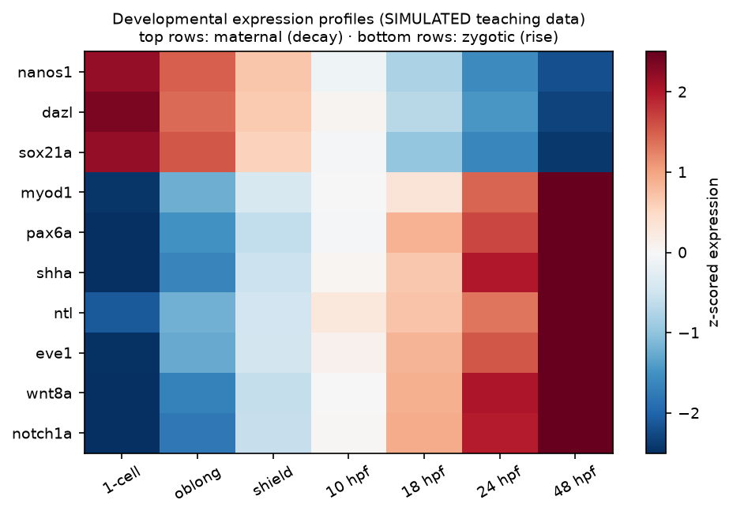
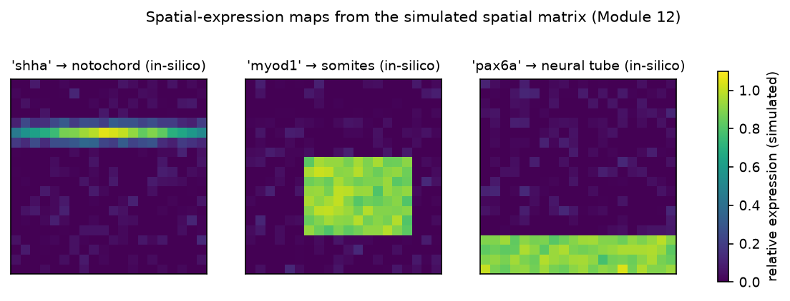

# Module 12 — Data Analysis

**Level:** Advanced / Computational

**Note:** all datasets in this course are **simulated for teaching** — they are clearly labeled, biologically plausible, and not real experimental results. Scripts run with Python 3 + numpy/pandas/matplotlib.

---

## Learning objectives

1. Interpret gel electrophoresis, colony-PCR, and digest data quantitatively.
2. Compute and interpret RT-qPCR relative expression (ΔΔCt) with controls.
3. Perform and interpret a mini bulk-RNA-seq differential-expression workflow.
4. Cluster cells from a mini scRNA-seq matrix and annotate clusters.
5. Read a spatial-expression matrix and identify tissue-specific genes and ligand–receiver structure.

---

## 1. Cloning data interpretation

### 1.1 Gel electrophoresis

Migration ∝ log(size). To size an unknown band, interpolate against the ladder:

```text
distance migrated (mm)   10   20   30   40   50
marker sizes (bp)     10000 3000 1000  500  100
                          log(size) vs distance → linear fit
unknown band at 27 mm → ~1200 bp (from the fit)
```

- **Supercoiled vs linear plasmids:** uncut plasmids migrate anomalously (supercoiled runs faster than its length suggests); always compare digested samples to digested controls or linear markers.
- **Quality flags:** smearing (degradation), trailing (overloading), smiling (voltage too high).

### 1.2 Colony PCR interpretation

| Pattern | Meaning | Action |
|---|---|---|
| Insert-size band only | Candidate correct clone | Mini-prep + digest |
| Empty-vector-size band only | Failed assembly | Check ligation/digest controls |
| Both bands | Mixed colony or indel | Re-streak single colony |
| No band | PCR failure or wrong primers | Re-run with positive control DNA |

### 1.3 Diagnostic digest interpretation

Compare the observed fragment pattern to the in-silico prediction:

```text
Design: 3.5 kb vector + 1.2 kb insert; digest EcoRI+HindIII
prediction:  3.5 kb + 1.2 kb (correct orientation irrelevant here)
observed:    3.5 + 1.2  → PASS
observed:    4.7 only   → empty vector (single site destroyed? check design)
observed:    2.4 + 1.2 + 1.1 → unexpected second site — revisit map
```

*(Full worked exercises: Labs 02 and 04; dataset: `DATA/cloning-data/`.)*

---

## 2. RT-qPCR analysis (ΔΔCt)

**Data:** Cq values per gene per sample (triplicates), reference gene(s) validated as stable.

```text
1. ΔCt = Cq(target) − Cq(reference)
2. ΔΔCt = ΔCt(condition) − ΔCt(control)
3. fold change = 2^(−ΔΔCt)      [assumes ~100% primer efficiency]
```

**Worked example (from `gene-expression-data/qPCR_timecourse.csv`):**

| Sample | Cq(target *shha*) | Cq(*ef1α*) | ΔCt | ΔΔCt vs 10 hpf | fold change |
|---|---|---|---|---|---|
| 10 hpf control | 24.0 | 16.0 | 8.0 | 0.00 | 1.0× |
| 12 hpf | 24.8 | 16.0 | 8.8 | 0.80 | 0.57× |
| 18 hpf | 26.0 | 16.0 | 10.0 | 2.00 | 0.25× |

*(Illustrative numbers; the real CSV has biological replicates and noise.)*

**Statistical practice:** analyze replicates; test ΔCt (or ΔΔCt) with appropriate models rather than comparing fold changes directly; report reference genes, efficiency, and control condition; efficiency-corrected methods (e.g., Pfaffl) when efficiencies differ from 100%.

**Common errors:** ignoring reference-gene instability; averaging fold changes instead of ΔCt; treating n=1 as n=3.

---

## 3. Bulk RNA-seq mini-workflow (simulated)

Files: `gene-expression-data/rnaseq_counts.csv` (genes × samples), `metadata.csv` (condition, stage).

```python
import pandas as pd, numpy as np
from scipy import stats

counts = pd.read_csv("DATA/gene-expression-data/rnaseq_counts.csv", index_col=0)
meta   = pd.read_csv("DATA/gene-expression-data/metadata.csv", index_col=0)

# 1. Simple size-factor-style normalization
lib    = counts.sum(axis=0)
norm   = counts / lib * 1e6            # CPM-style
log    = np.log2(norm + 1)

# 2. Differential expression: WT vs KO (3 replicates each)
wt  = log[meta[meta.condition=='WT'].index]
ko  = log[meta[meta.condition=='KO'].index]
lfc = ko.mean(axis=1) - wt.mean(axis=1)
# (real analyses use DESeq2/edgeR negative-binomial models on raw counts;
#  this mini-version teaches the logic)

# 3. Rank and inspect
top = lfc.sort_values()
print(top.head(10))   # down in KO
print(top.tail(10))   # up in KO
```

**Interpretation discipline:**

- **Fold change vs significance:** sort by |log2FC| but filter by adjusted p-value; a 0.2-log change with p≈0.9 is noise.
- **Multiple testing:** with 20,000 genes, 5% FDR → ~1,000 "significant" genes by chance — use FDR correction (Benjamini–Hochberg).
- **Effect vs count:** low-count genes have unstable FCs — filter low counts first.
- **Replicates:** n=3 is the floor for inference; batch must not confound condition (balanced design).

---

## 4. Single-cell analysis (simulated)

Files: `gene-expression-data/single_cell_counts.csv` (cells × genes), `cell_metadata.csv`.

```python
counts = pd.read_csv("DATA/gene-expression-data/single_cell_counts.csv", index_col=0)

# QC metrics
lib_size = counts.sum(axis=0)
n_genes  = (counts > 0).sum(axis=0)
keep     = (lib_size > 500) & (n_genes > 200)   # teaching thresholds

# Normalize (CPM) + log
lognorm  = np.log2(counts.loc[:, keep] / counts.loc[:, keep].sum(axis=0) * 1e6 + 1)

# Dimensionality reduction: PCA (numpy SVD)
X = lognorm.T.values               # cells × genes
Xc = X - X.mean(axis=0)
U, S, Vt = np.linalg.svd(Xc, full_matrices=False)
PCs = U[:, :2] * S[:2]             # first two PCs per cell

# Clustering: k-means (sklearn) or simple approach
from sklearn.cluster import KMeans
labels = KMeans(n_clusters=3, n_init=10, random_state=0).fit_predict(PCs)
```

**Interpretation:**

- Clusters = candidate cell types; annotate by marker genes (e.g., cluster expressing *pax6* high → neural; *myod1* high → muscle).
- **Pseudotime:** order cells along a trajectory (e.g., Monocle-style on PC1) — developmental ordering, *not* clock time.
- **Sparsity:** zeros are mostly dropout — don't interpret absence of a low transcript as absence of biology.

*(Full guided exercise: Lab 08.)*

---

## 5. Spatial-expression analysis (simulated)

Files: `spatial-expression-data/spatial_matrix.csv` (spots × genes), `spot_coordinates.csv` (x,y), `tissue_annotation.csv` (spot → region label).

**Exercise logic:**

1. Load matrix + coordinates; join annotations.
2. Compute region-mean expression; find genes specific to each region.
3. Plot each marker gene's expression over x,y → in-silico in situ.
4. Test a gradient: correlation of expression with distance from the tissue edge.
5. Ligand–receiver: does the ligand's spatial domain neighbor the receptor's domain? (e.g., ligand in notochord-annotated spots, receptor in adjacent neural-tube spots.)

```python
spatial = pd.read_csv("DATA/spatial-expression-data/spatial_matrix.csv", index_col=0)
coords  = pd.read_csv("DATA/spatial-expression-data/spot_coordinates.csv", index_col=0)
regions = pd.read_csv("DATA/spatial-expression-data/tissue_annotation.csv", index_col=0)

region_means = spatial.join(regions).groupby("region").mean()
markers = region_means.idxmax(axis=0)          # region with max expression
print(markers.value_counts())
```

**Interpretation:** region-specific genes = spatial markers; expression vs distance plots = gradients; neighboring complementary domains = candidate signaling axes. All *hypotheses* — validate with ISH (Module 11).

---

## 6. Building a developmental heatmap and profile

```python
import matplotlib.pyplot as plt
# time-course matrix: genes × stages
tc = pd.read_csv("DATA/gene-expression-data/developmental_timecourse.csv", index_col=0)

# z-score genes to compare patterns regardless of magnitude
z = (tc.sub(tc.mean(axis=1), axis=0)).div(tc.std(axis=1), axis=0)

fig, ax = plt.subplots(figsize=(7, 5))
im = ax.imshow(z.values, aspect="auto", cmap="RdBu_r", vmin=-2, vmax=2)
ax.set_xticks(range(len(tc.columns))); ax.set_xticklabels(tc.columns, rotation=45)
ax.set_yticks(range(len(tc.index)));  ax.set_yticklabels(tc.index)
plt.colorbar(im, label="z-scored expression")
ax.set_title("Developmental expression profiles (simulated)")
plt.tight_layout(); plt.savefig("heatmap.png", dpi=150)
```

Reading the heatmap: rows clustered by pattern (early-peak, mid-peak, late-rise); columns = stages. A *maternal* gene starts high and decays; a *zygotic* gene starts at zero and rises. That single distinction is the most important interpretive habit in developmental transcriptomics.

---

## 7. Reporting standards for this course

Any quantitative result you report must state:

1. **n** (biological replicates) — technical replicates don't substitute.
2. **Normalization** (which reference, which size factor).
3. **Statistics** (test, correction, threshold).
4. **Effect size** (fold change / log2FC), not just p-values.
5. **Version of data and code** (in the course: the CSV filenames).

---

## Figures

<figure markdown>


*Figure - A simulated developmental expression heatmap (genes x stages) of the kind analyzed in the data labs.*
</figure>

<figure markdown>


*Figure - In-silico spatial expression map used in the computational labs (region markers and gradients).*
</figure>


## 8. Self-check questions

1. An uncut plasmid runs "3 kb" on a gel but the map says 5 kb. Explain, and state what to digest with.
2. Why is it wrong to compute ΔΔCt per replicate and then average the fold changes?
3. Your DE analysis finds 1,800 genes at FDR<0.05 with |log2FC|<0.1. What's going on and what do you fix?
4. In the simulated scRNA data, cluster 3 has *myod1* high but low *actc1*. Propose the cell state and the follow-up experiment.
5. How would you demonstrate a spatial *gradient* (not just a domain) from the spatial matrix?
---

## What you should know

Review the learning objectives at the top of this module and the self-check or quick-check questions above. When you can meet every objective unaided, you are ready to continue.

## What you should be able to do

- Test yourself with the [multiple-choice questions](../assessment/MCQs.md) and the [short-answer](../assessment/Short-Questions.md) and [long-answer](../assessment/Long-Questions.md) questions for these topics.
- Instructors: model answers are in the [answer key](../assessment/Answer-Key.md).
- Quick revision: [cheat sheet](../guide/cheat-sheet.md) and [FAQs](../guide/faqs.md).
- Hands-on practice: the [laboratory overview](../labs/index.md).

[<- Gene-Expression Experimental Methods](../modules/11-Gene-Expression-Experimental-Methods.md) &middot; [Course home](../index.md) &middot; [Continue to next module ->](../modules/13-Applications-and-Case-Studies.md)
