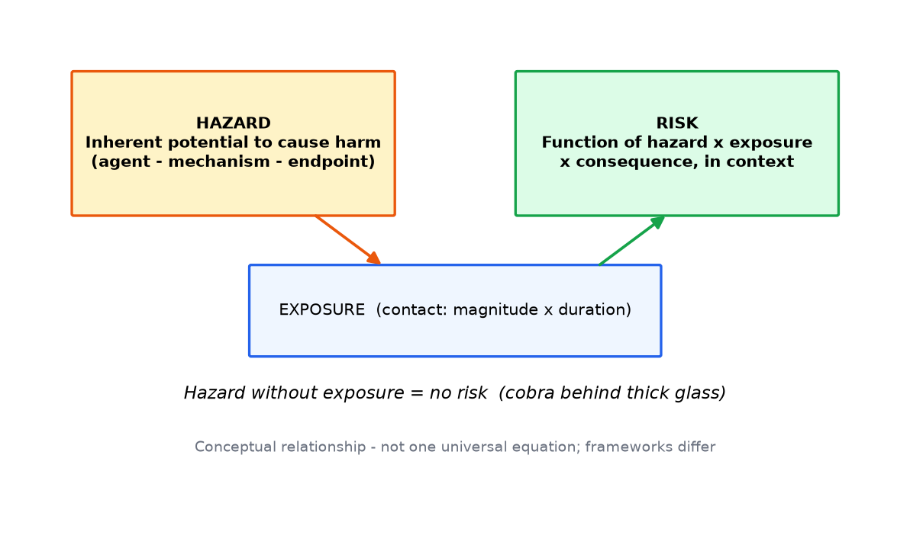
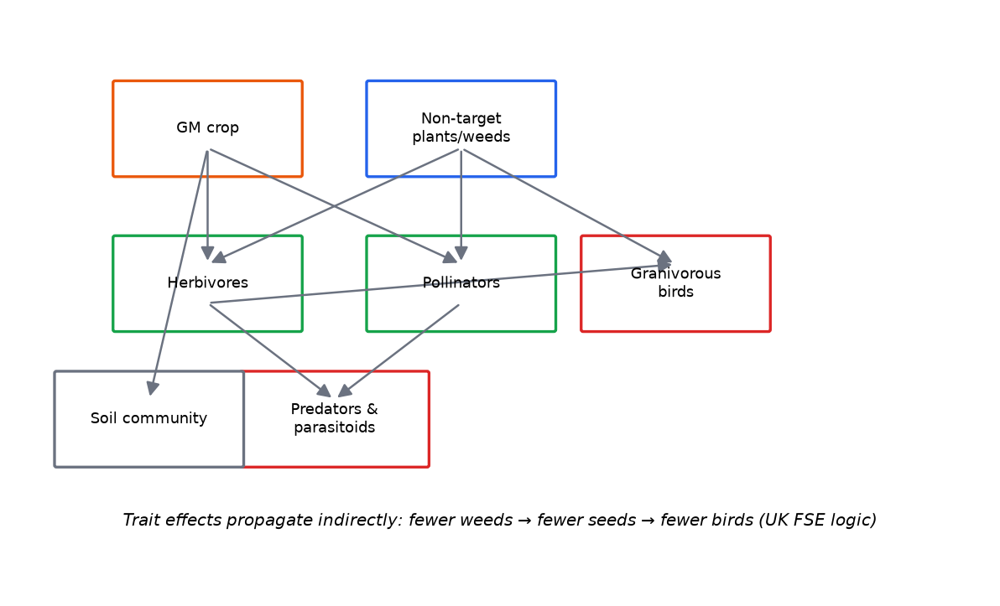
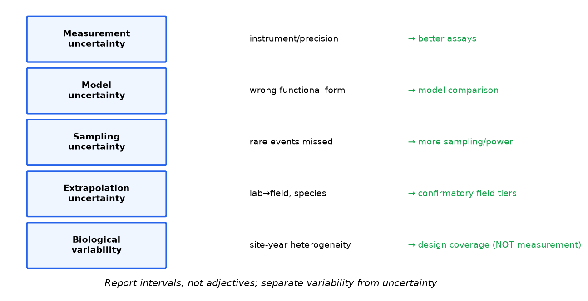
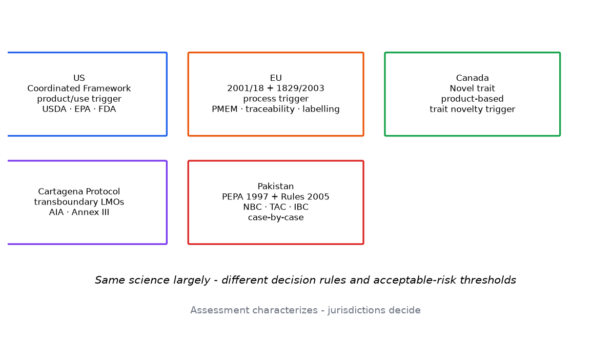
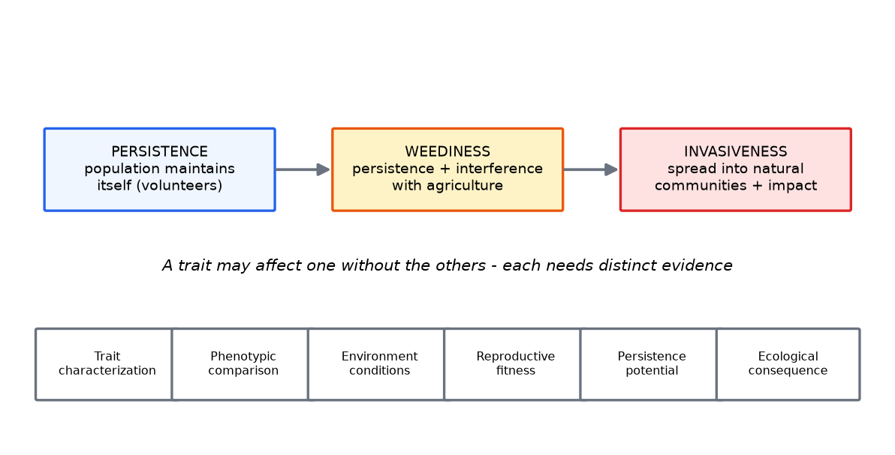
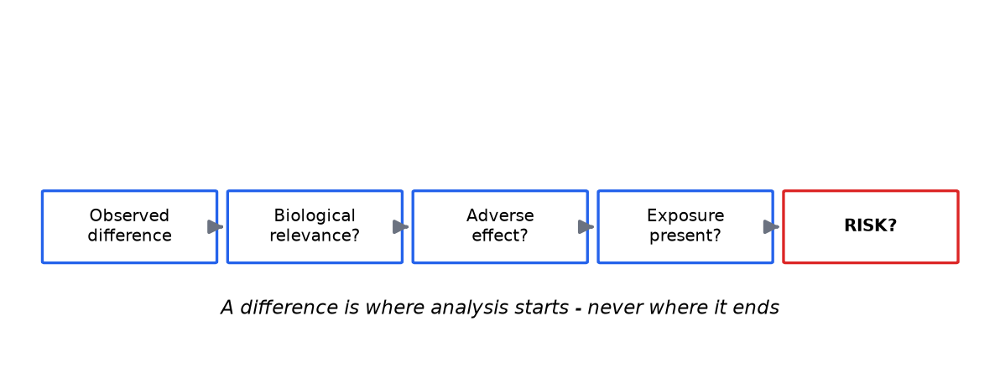
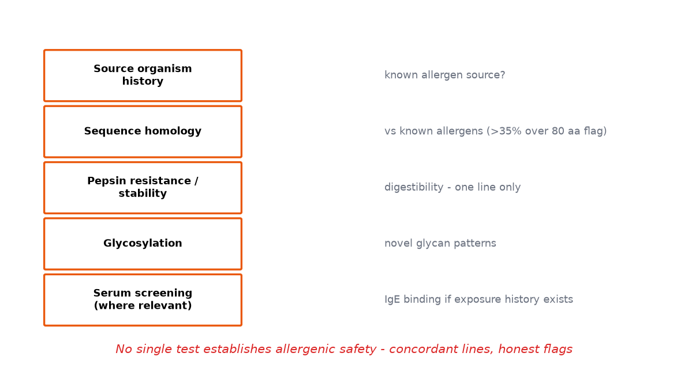
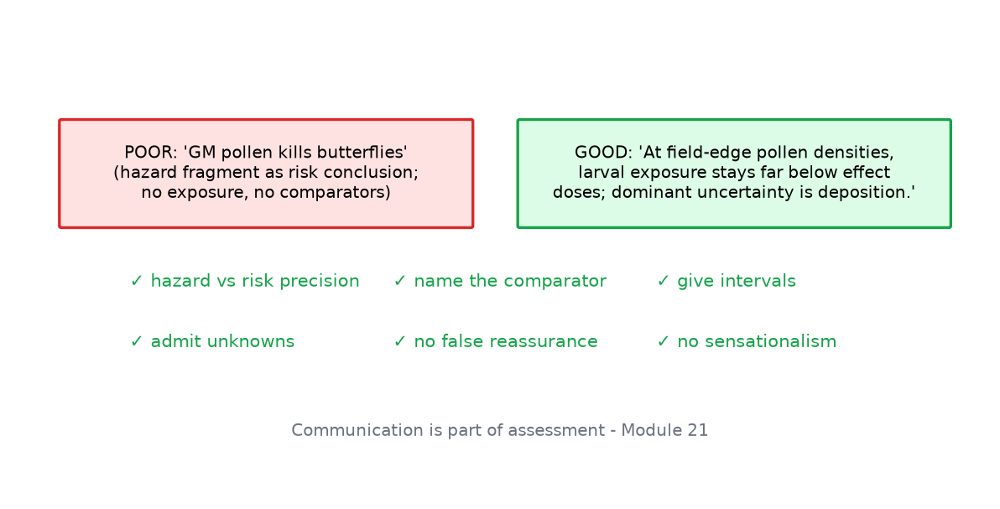

# Diagram gallery

All 20 original teaching diagrams with captions (captions double as alt text).

<figure markdown>

*Hazard versus risk: exposure, dose-response and context convert a hazard into a characterized risk.*
</figure>

<figure markdown>

*The environmental risk-assessment framework from problem formulation to risk communication.*
</figure>

<figure markdown>

*Pollen-mediated gene flow decays with distance; buffer zones act on the steep segment of the curve.*
</figure>

<figure markdown>

*The introgression pathway: every gate from sexual compatibility to trait persistence must pass.*
</figure>

<figure markdown>

*An exposure pathway chain from Bt maize to predators, with transfer factors at each step.*
</figure>

<figure markdown>

*Tiered non-target testing: escalate only on concern at realistic exposure.*
</figure>

<figure markdown>

*Resistance allele frequency follows a slow-then-explosive S-curve; refuges stretch the slow phase.*
</figure>

<figure markdown>

*The adaptive monitoring loop: baseline, release, monitoring, evaluation, response.*
</figure>

<figure markdown>

*A qualitative risk matrix with pre-declared likelihood and consequence anchors.*
</figure>

<figure markdown>

*Food-web routes by which trait effects propagate indirectly through communities.*
</figure>

<figure markdown>

*Logistic dose-response curves showing orders-of-magnitude selectivity between target and non-target species.*
</figure>

<figure markdown>

*Monte Carlo output is a distribution: median, interval and threshold exceedance, not a point.*
</figure>

<figure markdown>

*Uncertainty types with their remedies; variability needs design coverage, not better instruments.*
</figure>

<figure markdown>

*The risk-management cycle: characterize, select instruments, implement, monitor, adapt.*
</figure>

<figure markdown>

*Regulatory approaches compared: product/use triggers, process triggers and the Cartagena framework.*
</figure>

<figure markdown>

*Persistence, weediness and invasiveness are distinct concepts with distinct evidence bases.*
</figure>

<figure markdown>

*The interpretive chain from observed difference to characterized risk.*
</figure>

<figure markdown>

*The weight-of-evidence allergenicity assessment: no single test is decisive.*
</figure>

<figure markdown>

*Risk communication: poor vs good framing, with best-practice rules.*
</figure>

<figure markdown>

*The course roadmap across all 25 modules and 12 practicals.*
</figure>
