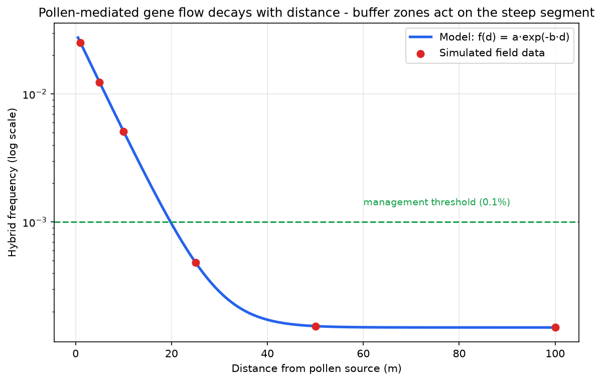

# Lab 03 — Gene-Flow Data Analysis

**Activity type:** Computational Exercise
**Duration:** 2.5 hours · **Level:** Intermediate

---

## Learning objectives

By the end of this practical you will be able to:

1. Summarise hybrid-frequency data by distance and quantify uncertainty.
2. Fit and interpret a negative-exponential decay model of pollen-mediated gene flow.
3. Translate a fitted decay curve into a risk-management statement (isolation distance vs threshold).
4. Critique the dataset's limitations for regulatory extrapolation.

## Background

Pollen-mediated gene flow from a transgenic crop to non-GM fields or wild relatives typically decays with distance. Risk assessors use this decay to set isolation distances and buffer zones. The assessment question is never "is gene flow zero?" (it never is) but "below what frequency does consequence become negligible, and at what distance does the curve cross that threshold?"

## Scientific principle

Empirically, outcrossing frequency *f(d)* versus distance *d* is well approximated by a decaying exponential (plus a long tail that field data barely capture):

```text
f(d) = a · exp(−b·d)
```

Parameters: *a* = near-field (edge) frequency; *b* = decay constant. **Risk-management logic:** the buffer zone works on the steep part of the curve; the flat tail means zero flow is unattainable, so "acceptable frequency" is a management threshold — a judgment, informed by the biology.

## Materials/data

- `DATA/gene-flow/gene_flow_by_distance.csv` — simulated hybrid frequencies at 1, 5, 10, 25, 50, 100 m from the pollen source; 12 replicate plots per distance. **Clearly labelled simulated data.**
- Python 3 with numpy/pandas/matplotlib.
- Reference implementation: `DATA/analysis_demo.py` (Exercise 1 section).

## Safety

No biosafety concerns (computational exercise on simulated data).

## Step-by-step workflow

1. **Load and inspect** — check columns, units, missing values, n per group.
2. **Summarise** — mean hybrid frequency and standard error per distance (table below).
3. **Visualise** — scatter of raw values with mean ± 95% CI per distance, log-y axis.
4. **Fit** — log-linearise and fit `ln f = ln a − b·d`; report R².
5. **Threshold analysis** — find the distance where the fitted curve's upper 95% bound falls below 0.001 (0.1%).
6. **Interpret** — write the management sentence the curve supports.
7. **Challenge** — repeat with a half-size source field; how do *a* and *b* move?

## Data tables

**Table 1 (complete during Step 2):**

| Distance (m) | Mean frequency | SE | n |
|---|---|---|---|
| 1 | | | |
| 5 | | | |
| 10 | | | |
| 25 | | | |
| 50 | | | |
| 100 | | | |

**Table 2 (Step 5):**

| Threshold | Distance where upper 95% bound < threshold |
|---|---|
| 0.001 | |

## Calculations

- Wilson or normal-approximation 95% CI per distance (state which and why).
- Least-squares fit on log-transformed data: `ln(a)`, `b`, R².
- Inverse prediction: `d(0.001) = ln(a/0.001)/b`.

## Expected results

(Simulated dataset — documented by `analysis_demo.py`.) Frequency falls from ≈0.030 at 1 m to ≈0.0002 at 100 m; the fit is strongly exponential (R² > 0.95 on log scale); the 0.1% threshold is crossed between roughly 15–30 m for the *point* estimate, later for the upper bound.

## Figures

<figure markdown>


*Figure - Pollen-mediated gene flow decays with distance; buffer zones act on the steep segment of the curve.*
</figure>


## Interpretation

- A buffer of ~30 m makes *typical* gene flow below 0.1%; making it below 0.1% with **95% confidence** requires more distance (or wider buffers) — report both, not just the point estimate.
- The tail matters: seed spillage and machinery transfer bypass pollen distance entirely, so isolation distance alone is never sufficient (Module 6).

## Troubleshooting

| Symptom | Cause | Fix |
|---|---|---|
| Fit curve bends on log plot | Non-exponential tail; plot suggests power-law | Report both models; use empirical interpolation for thresholds |
| Negative predicted frequencies | Fitting raw (not log) data | Fit on log scale; back-transform |
| CI crossing zero | Small n at far distances | Use Wilson interval; report n explicitly |

## Questions

1. Why fit on the log scale for this dataset?
2. At 100 m the minimum observed frequency is 0. Is that evidence of *absence* of gene flow? Explain using "not detected" vs "absent."
3. Your upper-bound distance is ~1.6× the point-estimate distance. What does that gap tell the risk manager?
4. Which unmeasured variable most limits extrapolation to a real landscape, and why?

## Viva questions

1. Define pollen-mediated gene flow.
2. Why can buffer zones never reduce gene flow to zero?
3. What is introgression, and how does it differ from first-generation hybridisation?
4. Name two non-pollen routes of transgene movement.

## Instructor answer key

- Q1: Variance scales with the mean and the relationship is multiplicative; log-linearising makes the exponential fit a simple linear regression with well-behaved errors.
- Q2: No — zero observations at that distance is consistent with frequencies below the detection limit given n=12; absence of detection ≠ absence of flow (distinguish statistically).
- Q3: The manager's confidence, not just the expected value, determines compliance risk; a rule set at the point estimate fails one field in twenty by construction.
- Q4: Flowering synchrony (temporal overlap) — it can dominate frequency and varies year to year; the dataset holds it constant.

## Advanced challenge

Simulate a landscape of 50 recipient fields at random distances using your fitted (a, b), add Poisson sampling noise, and estimate the probability that **at least one** field exceeds the 0.1% threshold. How does that landscape-scale probability change the management conclusion compared with single-field analysis?

---

*Previous: [Lab 02 — Risk-Assessment Workflow](../../risk/labs/Lab-02-Risk-Assessment-Workflow.md) · Next: [Lab 04 — Non-Target Data Analysis](../../risk/labs/Lab-04-Non-Target-Data-Analysis.md)*

---

**Related resources:** [Practical workbook](../guide/workbook.md) - [Cheat sheet](../guide/cheat-sheet.md) - [Datasets](../downloads/datasets.md) - [Assessments](../assessment/index.md)

[Course home](../../index.md)
