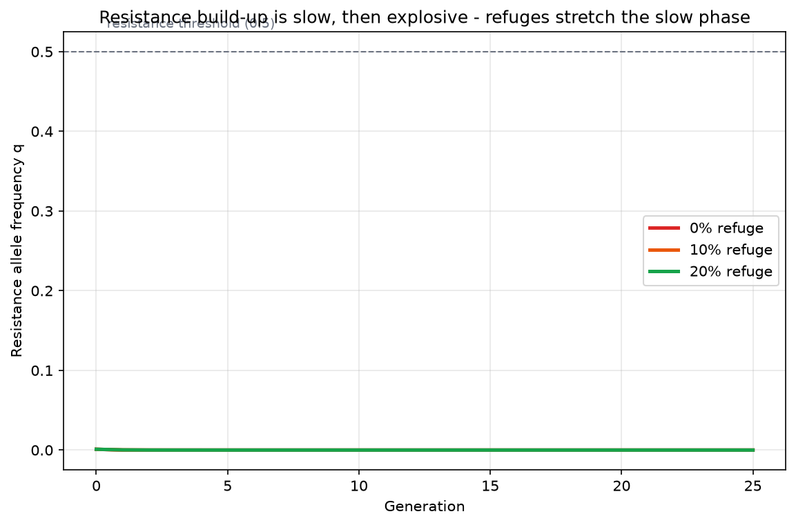

# Lab 05 — Resistance Evolution Simulation

**Activity type:** Computational Exercise (Simulation)
**Duration:** 3 hours · **Level:** Intermediate → Advanced

---

## Learning objectives

1. Implement a simple single-locus selection recursion for a resistance allele under Bt exposure with and without refuges.
2. Explain why resistance build-up follows a slow–fast (S-shaped) trajectory.
3. Quantify the refuge effect: years to resistance threshold at 0%, 10%, 20% refuge.
4. Identify the two parameters to which the model outcome is most sensitive — and why they are hard to estimate.

## Background

Bt crops impose intense, season-long selection on target pests. The **high-dose/refuge strategy** exploits population genetics: refuges of non-Bt hosts sustain susceptible alleles that dilute resistance when rare. This lab makes the strategy quantitative (Module 11 provides the biology; Module 25.3 the modelling context).

## Scientific principle

Single-locus recursion with resistance allele frequency `q`, relative fitnesses on Bt crop `w_RR, w_RS, w_SS` (resistant homozygotes survive; heterozygotes survive only if the dose is not "high"), and refuge fraction `r`:

```text
q' = [ q²·w_RR + q(1−q)·w_RS ] · r + q_on_bt·(1−r)     (normalised)
```

with `q_on_bt` computed from Bt-field fitnesses and `r` the refuge share. Two features drive the classic S-curve: (i) selection on a **rare recessive** allele is weak (heterozygotes die on Bt), so early growth is slow; (ii) once `q` is high, most resistance alleles sit in protected homozygotes and frequency rockets.

## Materials/data

- `DATA/resistance/` — simulated resistance-frequency trajectories over 25 generations at refuge levels 0%, 10%, 20% (seeded). **Simulated data.**
- Python 3 (numpy, pandas, matplotlib); reference: `DATA/analysis_demo.py` Exercise 3.
- Provide your own spreadsheet alternative if Python access is limited.

## Safety

No biosafety concerns.

## Step-by-step workflow

1. **Run the baseline** recursion (`r=0`) and plot q vs generation.
2. **Add refuges** (`r=0.1, 0.2`) and overlay the three trajectories.
3. **Threshold analysis:** generations until `q = 0.5` for each refuge level (Table 1).
4. **Sensitivity:** vary initial `q₀` (0.0001, 0.001, 0.01) and resistance dominance `h` (0, 0.1, 0.5); record years-to-resistance in Table 2.
5. **Management reading:** convert each result into one risk-management sentence (Module 18 framing).
6. **Challenge:** add fitness costs (`w_RR = 1 − c` on refuge) and find the cost `c` that stabilises q under 10% refuge.

## Data tables

**Table 1 — refuge effect (from provided simulation):**

| Refuge (%) | Generation q reaches 0.5 | Management sentence |
|---|---|---|
| 0 | | |
| 10 | | |
| 20 | | |

**Table 2 — sensitivity:**

| q₀ | h | Years to q=0.5 (10% refuge) |
|---|---|---|
| 0.0001 | 0.0 | |
| 0.001 | 0.1 | |
| 0.01 | 0.5 | |

## Calculations

- Implement the recursion (course `analysis_demo.py` shows a reference implementation; students must write their own and compare outputs — identical results validate both).
- Report the resistance **growth rate** `Δq/q` per generation for generations 1–5, 10–15, 20–25; relate the pattern to the S-curve.

## Expected results

(Simulated — documented by `analysis_demo.py`.) With no refuge, resistance rises to fixation within the simulation window; 10% refuge delays it several-fold; 20% refuge pushes it beyond the horizon. Slow early growth while q is recessive-rare, explosive growth once q is common — the documented nonlinear build-up with a dramatic refuge effect.

## Figures

<figure markdown>


*Figure - Resistance allele frequency follows a slow-then-explosive S-curve; refuges stretch the slow phase.*
</figure>


## Interpretation

- The refuge works **only while resistance is rare** — monitoring (Module 19) is what tells you the strategy is still working; by the time field failures appear, q is already high.
- Sensitivity results explain why regulators demand conservative assumptions on initial frequency and dominance: model output is dominated by parameters measured with difficulty.
- Resistance management is not a static rule; it is adaptive management with monitoring triggers (Module 19 workflow).

## Troubleshooting

| Symptom | Cause | Fix |
|---|---|---|
| q hits 1.0 with NaN afterwards | No normalisation | Normalise mean fitness each generation |
| No S-shape, straight line | Dominance set high (h≈0.5) | That is the point — re-run with h=0 and compare |
| Refuges look useless | Refuge insects also on Bt (spatial error) | Refuge fraction must apply to *non-Bt* mating pool |

## Questions

1. Why is early selection weak when resistance is recessive, even under a "high-dose" regime?
2. Your 20% refuge delays resistance beyond the horizon. Does that prove resistance will never evolve? What is the honest statement?
3. How would stacked pyramids (two toxins) change the effective dominance?
4. What monitoring design detects q=0.001? Is that feasible?

## Viva questions

1. Define the high-dose/refuge strategy.
2. Why must refuges produce **susceptible adults that mate with in-field adults**?
3. What is cross-resistance and why do pyramids reduce it?
4. Name two real-world factors the simple model omits.

## Instructor answer key

- Q1: Almost all resistance alleles sit in heterozygotes, which die on a high-dose Bt crop; selection acts only on the tiny RR fraction, so Δq ∝ q² is very small while q is rare.
- Q2: No — delay beyond the horizon is not absence; with longer horizons or lower fitness costs, evolution continues; honest statement: "under these assumptions, q stays below 0.5 for >25 generations."
- Q3: With two toxins and no cross-resistance, insects heterozygous at both loci die, effectively reducing functional dominance and slowing evolution (the pyramid rationale).
- Q4: Sampling for q=0.001 requires ≈3,000 alleles per population for ~95% detection chance; feasible only with pooled/sequencing methods and dense coverage.

## Advanced challenge

Replace the deterministic recursion with a stochastic one (binomial sampling of alleles each generation, N=10,000) and run 1,000 replicates per refuge level. Report the **distribution** (not the mean) of years-to-resistance and the probability of resistance within 10 years. How does the stochastic answer change the management sentence from Table 1?

---

*Previous: [Lab 04 — Non-Target Data Analysis](../../risk/labs/Lab-04-Non-Target-Data-Analysis.md) · Next: [Lab 06 — Environmental Exposure Analysis](../../risk/labs/Lab-06-Environmental-Exposure-Analysis.md)*

---

**Related resources:** [Practical workbook](../guide/workbook.md) - [Cheat sheet](../guide/cheat-sheet.md) - [Datasets](../downloads/datasets.md) - [Assessments](../assessment/index.md)

[Course home](../../index.md)
