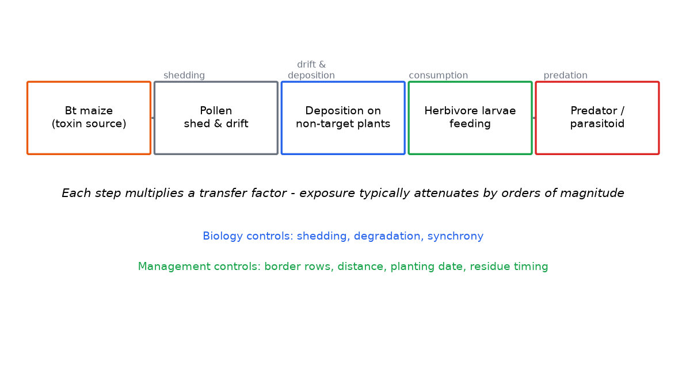

# Lab 06 — Environmental Exposure Analysis

**Activity type:** Computational Exercise
**Duration:** 2.5 hours · **Level:** Intermediate

---

## Learning objectives

1. Map an exposure pathway from source to receptor (crop → pollen → plant → herbivore → predator).
2. Quantify exposure magnitude at each pathway step from simulated field data.
3. Combine concentration × duration × rate into an exposure estimate with stated assumptions.
4. Identify where in a pathway exposure is controlled by biology vs by management.

## Background

Risk = hazard × exposure (conceptually). Module 13 teaches the pathway logic; this lab makes one full pathway quantitative: **Bt maize → pollen → drift onto non-target host plants → herbivore larvae feeding → predator consuming larvae.** Each step multiplies (and usually attenuates) exposure; each step is also a place where monitoring or management can intervene.

## Scientific principle

Step-wise exposure propagation:

```text
E_step = C_source × Transfer(step) × Attenuation(step)
E_total = Π steps
```

Transfer factors (pollen drift fraction, deposition density, larval consumption rate) come from the dataset; attenuation (protein degradation, metabolic dilution) comes from the fate data. The final receptor dose is typically **orders of magnitude below** the source concentration — quantifying that attenuation chain *is* the assessment.

## Materials/data

- `DATA/exposure/` — simulated: pollen protein concentration, pollen densities on sticky stations at 0/5/25/100 m into the margin, protein degradation over days, larval consumption rates, predator diet composition. **Simulated data.**
- Python 3; reference: `DATA/analysis_demo.py` Exercise 7.

## Safety

No biosafety concerns.

## Step-by-step workflow

1. **Draw the pathway** (five boxes, arrows labelled with the transfer factor each represents).
2. **Pollen density by distance** — mean and CI per station distance; plot decay curve.
3. **Protein decay** — estimate the degradation half-life from the time series; fit exponential.
4. **Multiply the chain** — compute predator-reachable dose under (a) field-edge, (b) 25 m, (c) 100 m scenarios.
5. **Compare doses** with the species' high-dose laboratory threshold (provided in the dataset notes) → simple hazard quotient per scenario.
6. **Interpret** — which step controls the final dose; where would management act?
7. **Challenge:** add flowering-synchrony variability (±10 days) and propagate it through the chain (Exercise 10 methods).

## Data tables

| Step | Transfer/attenuation factor | Value (mean) | 95% CI | Source of variability |
|---|---|---|---|---|
| Pollen protein conc. | — | | | |
| Deposition at 5 m | fraction of source | | | |
| Deposition at 25 m | fraction | | | |
| Deposition at 100 m | fraction | | | |
| Protein half-life | days | | | |
| Larval consumption | µg/day | | | |
| Predator dose | µg/day | | | |

## Calculations

- Exponential decay fit for both distance (pollen) and time (protein).
- Hazard quotient `HQ = receptor dose / high-dose threshold` per scenario; interpret HQ < 1 vs > 1 with its uncertainty.
- Propagate one parameter's CI through the chain (worst-case vs best-case arithmetic).

## Expected results

(Simulated — documented by `analysis_demo.py`.) Pollen deposition falls steeply with distance; protein decays with a half-life of a few days; the receptor dose at field edge remains 10–100× below the high-dose threshold, and at 100 m the margin widens further. The chain demonstrates **exposure attenuation by orders of magnitude** — the quantitative backbone of the monarch-case logic (Case 2).

## Figures

<figure markdown>


*Figure - An exposure pathway chain from Bt maize to predators, with transfer factors at each step.*
</figure>


## Interpretation

- The **biology-controlled** steps (pollen shed, degradation) set the ceiling; the **management-controlled** steps (border rows, distance, timing vs flowering) offer the levers.
- An HQ near 1 under worst-case assumptions flags the parameter to measure better — not necessarily a risk (Module 16–17 chain: difference → relevance → adverse? → exposure? → risk?).
- Every number in the chain carries uncertainty; the honest product is an interval, not a point (Module 23).

## Troubleshooting

| Symptom | Cause | Fix |
|---|---|---|
| HQ enormous | Threshold misread (per-day vs per-larva units) | Check units at every step — the classic error |
| Decay fit poor | Tail measured imprecisely | Fit on log scale; report residuals |
| Dose exceeds source | Transfer factors >1 (unit error) | Transfer fractions must be ≤1; audit the table |

## Questions

1. Which single parameter most influences the final predator dose, and how do you know?
2. Why does the hazard quotient use the *high-dose laboratory* threshold rather than a field observation?
3. Name two management interventions and the pathway step each targets.
4. Your worst-case HQ = 0.8. What is the correct risk statement?

## Viva questions

1. Define exposure pathway and name its components for Bt pollen.
2. Why does attenuation across a trophic step not always reduce risk proportionally?
3. What is flowering synchrony and why does it gate the whole pathway?
4. Distinguish environmental fate from exposure.

## Instructor answer key

- Q1: Usually the deposition-at-edge fraction (largest relative CI and leverage); establish via the sensitivity calculation (Step 7 / Exercise 10).
- Q2: A conservative screening device — if even the laboratory ceiling dose is not approached, pathway risk is negligible for that route; it is a bound, not a field-relevant estimate.
- Q3: Border rows / isolation distance target the deposition step; planting-date choice targets the synchrony step; residue-timing targets the decay step.
- Q4: "Under worst-case assumptions the receptor dose remains below the laboratory high-dose threshold, but the margin is narrow (HQ 0.8); measurement of the dominant parameter is warranted before concluding negligible risk." — not "safe," not "dangerous."

## Advanced challenge

Build the full pathway as a Monte Carlo (1,000 draws from each parameter's distribution, Exercise 10 tooling) and report the distribution of HQ at field edge and 25 m. What percentage of runs exceed HQ = 1, and which parameters drive the exceedance tail?

---

*Previous: [Lab 05 — Resistance Evolution Simulation](../../risk/labs/Lab-05-Resistance-Evolution-Simulation.md) · Next: [Lab 07 — Compositional Assessment](../../risk/labs/Lab-07-Compositional-Assessment.md)*

---

**Related resources:** [Practical workbook](../guide/workbook.md) - [Cheat sheet](../guide/cheat-sheet.md) - [Datasets](../downloads/datasets.md) - [Assessments](../assessment/index.md)

[Course home](../../index.md)
