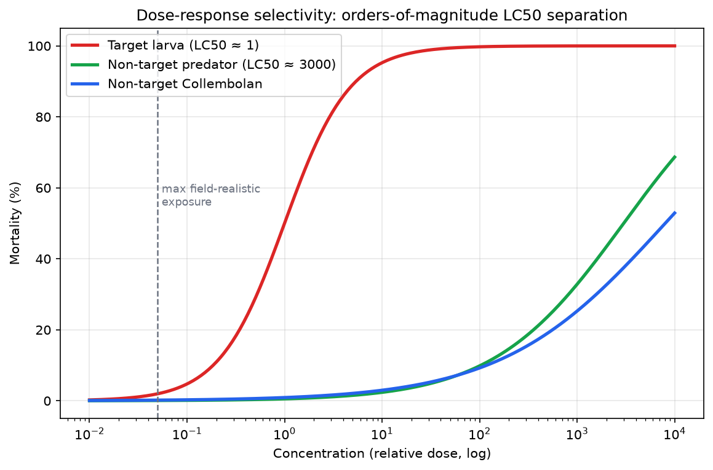

# Lab 08 — Dose–Response Data Analysis

**Activity type:** Computational Exercise
**Duration:** 2.5 hours · **Level:** Intermediate → Advanced

---

## Learning objectives

1. Fit and interpret a logistic dose–response model; define and estimate LC50 conceptually.
2. Contrast dose–response curves of a target pest and a non-target species exposed to the same protein.
3. Connect curve parameters to ERA statements (specificity, margins of exposure).
4. Explain what dose–response evidence can and cannot conclude about chronic/sublethal effects.

## Background

Toxicological assessment (Module 15) rests on dose–response: response increases with dose in a defined way, and *specificity* is observed as curve separation between sensitive (target) and insensitive (non-target) organisms. For Bt proteins the target/non-target separation is the scientific basis for environmental selectivity; this lab quantifies that logic on simulated data.

## Scientific principle

Logistic model for mortality at dose *d*:

```text
p(d) = 1 / (1 + exp(−β·(ln d − ln LC50)))
```

- **LC50** — dose killing 50% of test organisms (a hazard-characterisation parameter).
- **Slope β** — steepness; shallow slopes complicate threshold-setting.
- **Separation of LC50s** between species = selectivity margin; the ERA uses the margin relative to *realised environmental exposure* (Lab 06 logic).

## Materials/data

- `DATA/dose-response/` — simulated mortality at 6–8 doses for: (i) target lepidopteran larva, (ii) non-target predator, (iii) non-target soil Collembolan; n=50 per dose; **simulated data** with a documented LC50 separation of several orders of magnitude.
- Python 3; reference: `DATA/analysis_demo.py` Exercise 8.

## Safety

No biosafety concerns.

## Step-by-step workflow

1. **Plot** raw mortality vs dose (log x) for the three species on one figure.
2. **Fit** logistic curves (or read from the reference implementation); record LC50 and slope per species (Table 1).
3. **Compute** the selectivity margin LC50(non-target)/LC50(target).
4. **Overlay** field-realistic exposure estimates (from Lab 06 dataset notes) as vertical lines; compute margins of exposure.
5. **Interpret** the three-species picture as a risk-assessment paragraph.
6. **Challenge:** simulate sublethal endpoints (development time) and discuss why curve-based LC50 logic does not automatically cover them.

## Data tables

**Table 1:**

| Species | LC50 (est.) | Slope β | 95% CI of LC50 |
|---|---|---|---|
| Target larva | | | |
| Non-target predator | | | |
| Non-target Collembolan | | | |

**Table 2 — margins of exposure at the three Lab-06 scenarios:** species × scenario grid; each cell = LC50 / estimated field dose.

## Calculations

- LC50 by interpolation on the fitted curve (state method).
- Selectivity margins (show one division with units).
- Margin of exposure per scenario (state conservative vs central estimates).

## Expected results

(Simulated — documented by `analysis_demo.py`.) Target species: steep curve, low LC50. Non-targets: high LC50s — several orders of magnitude above the target's — with shallow curves. Field-realistic exposure lines sit far below every non-target LC50. The documented conclusion: strong selectivity margin; risk to these non-targets via this route negligible **for acute lethality at these exposures**.

## Figures

<figure markdown>


*Figure - Logistic dose-response curves showing orders-of-magnitude selectivity between target and non-target species.*
</figure>


## Interpretation

- The *combination* of steep target response, high non-target LC50s, and low environmental exposure is what makes the environmental conclusion robust — remove any one leg and the conclusion weakens (good illustration of weight of evidence).
- Chronic and sublethal endpoints (development, fecundity, behaviour) are **not** captured by acute LC50 logic; Module 15's weight-of-evidence discussion and Lab 04's tiered design address them. Do not over-claim from this lab.
- Slope matters for thresholds: with shallow slopes, small concentration errors move the predicted response a lot — one more reason to propagate uncertainty.

## Troubleshooting

| Symptom | Cause | Fix |
|---|---|---|
| Fit fails at extremes | 0% / 100% mortality anchors | Use a link that handles binomial extremes, or trim anchor doses for fitting while keeping them in plots |
| LC50 outside dose range | Weak dose placement | Note as a design limitation; bracket the LC50 properly next time |
| Species curves cross | Interaction of slope and scale | Discuss in terms of low-dose behaviour, not just LC50 |

## Questions

1. Why is a several-orders-of-magnitude selectivity margin more convincing than a factor of two?
2. A non-target LC50 cannot be reached at any tested dose. How do you report an LC50 you could not estimate?
3. Your field-exposure line sits below the target species' LC10. What does that say about *target* mortality expectations?
4. Why doesn't this lab's conclusion extend to chronic effects?

## Viva questions

1. Define dose–response and LC50.
2. What is a margin of exposure and how is it used?
3. Why do Bt proteins require midgut activation — and what does that imply for specificity?
4. Name two sublethal endpoints relevant to non-target risk.

## Instructor answer key

- Q1: Large margins buffer every uncertainty in the chain (exposure, slope, species extrapolation); a factor of two can be erased by a single measurement error, orders of magnitude cannot.
- Q2: Report as "> highest tested dose" with the value stated — an inequality, not a number; that is standard hazard-characterisation practice.
- Q3: It predicts little target mortality in the field — a paradox typical of forced-dose comparisons and a cue to check exposure assumptions (in the crop itself, target larvae feed on tissue, not pollen — exposure route differs).
- Q4: Acute curves measure lethality over a fixed exposure window; sublethal/chronic effects need life-table or multigeneration designs with their own dose-response logic.

## Advanced challenge

Fit the curves with a bootstrap over organisms (resample within dose) and report the *distribution* of the selectivity margin. What is the 5th percentile of the margin, and does the ERA conclusion survive at that conservative percentile?

---

*Previous: [Lab 07 — Compositional Assessment](../../risk/labs/Lab-07-Compositional-Assessment.md) · Next: [Lab 09 — Risk-Ranking Matrix](../../risk/labs/Lab-09-Risk-Ranking-Matrix.md)*

---

**Related resources:** [Practical workbook](../guide/workbook.md) - [Cheat sheet](../guide/cheat-sheet.md) - [Datasets](../downloads/datasets.md) - [Assessments](../assessment/index.md)

[Course home](../../index.md)
