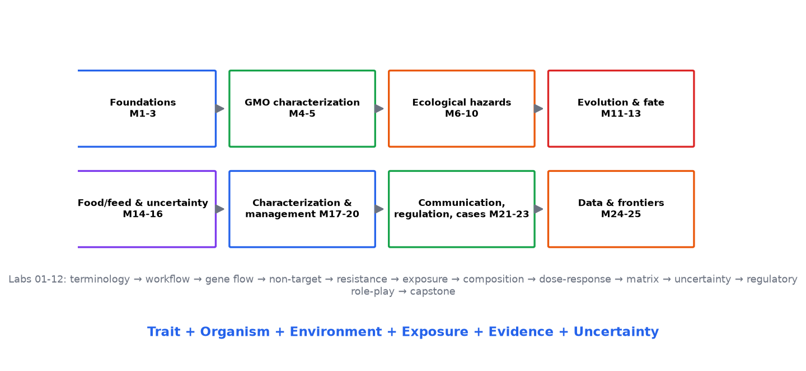

# Module 1 — Introduction to GMO Risk Assessment

**Level:** Beginner (foundation for the whole course)

---

## Learning objectives

1. Define **GMO environmental risk assessment** and explain what it does and does not claim to do.
2. Explain **why** risk assessment is performed before (and after) environmental release of a GMO.
3. Place risk assessment inside the larger cycle: development → assessment → decision → management → monitoring.
4. Recognize the **case-by-case** principle: why every GMO × environment combination is assessed on its own terms.
5. State the objectivity standard of this course: neither advocacy for nor against GMOs, but evidence-based evaluation.

---

## 1. What is GMO environmental risk assessment?

**Definition.** Environmental risk assessment (ERA) of GMOs is the structured, scientific evaluation of the likelihood and severity of harm to the environment — organisms, populations, communities, ecosystems, and the processes that sustain them — that could result from the release or use of a genetically modified organism.

**Definition (operational).** An ERA compares *what could happen* with *what does happen* in comparable non-GMO systems, asks whether any difference matters biologically, quantifies how likely and how large it could be, and reports what is known, what is assumed, and what is uncertain.

**Why it matters.** Genetic modification can deliberately give organisms new capabilities — an insecticidal protein, tolerance to an herbicide, altered flowering time, faster growth. Those capabilities change how the organism interacts with its environment. Risk assessment is how society decides, in advance and on evidence, which interactions are acceptable, which need management, and which are not acceptable at all.

### 1.1 What risk assessment is NOT

| Risk assessment is... | Risk assessment is NOT... |
|---|---|
| A structured analysis of evidence | An opinion poll about GMOs |
| Comparative (GMO vs non-GMO counterpart) | An absolute safety certification |
| Case-by-case | A one-size-fits-all verdict on "GMOs" |
| Explicit about uncertainty | A guarantee of no risk |
| Input to a decision | The decision itself (that adds values, law, policy) |
| Iterative (revised as data arrive) | A one-off hurdle |

## 2. Why organisms are assessed — the logic of concern

Not every genetic modification deserves the same scrutiny. Assessment effort is allocated by **familiarity** and **concern**:

- **Familiar organism?** Long history of safe use in the same environment lowers baseline uncertainty.
- **Familiar trait?** Traits with well-characterized biology (e.g., a protein humans have eaten for decades) raise fewer questions than genuinely novel functions.
- **Familiar receiving environment?** A contained greenhouse, a farm field, a wild ecosystem, and a human gut pose different exposure questions.
- **Novel combination?** Risk arises from the *specific* trait–organism–environment triplet, which is why the case-by-case principle dominates modern frameworks.

```text
Familiarity high   →   simpler, targeted assessment
Familiarity low    →   broader questions, more data, more uncertainty analysis
```

## 3. The life-cycle of an assessed GMO

```text
GMO development (lab/greenhouse)
        ↓
Intended trait characterized (molecular + phenotypic)
        ↓
Hazard identification  —— what could go wrong?
        ↓
Exposure assessment    —— how likely, how much, to whom?
        ↓
Risk characterization  —— so what? how bad, how likely, how certain?
        ↓
Environmental / ecological / food-feed assessment (as applicable)
        ↓
Risk management        —— what can be done to reduce or contain risk?
        ↓
Decision (release / refuse / release-with-conditions)
        ↓
Monitoring             —— were we right? what changed?
        ↓  (feedback to all earlier stages)
```

This loop is the backbone of the entire course. Modules 3, 17–20 examine its stages in depth; Modules 4–16 supply the scientific evidence that feeds it; Modules 21–23 cover communication, regulation, and real cases.

## 4. The case-by-case principle in action

Consider four hypothetical releases of "the same" Bt trait:

| Case | Trait | Organism | Receiving environment | Dominant assessment questions |
|---|---|---|---|---|
| A | cry protein | maize | maize belt with wild relatives 800 km away | non-target exposure, resistance management, food/feed composition |
| B | cry protein | maize | centre of crop-wild hybridization zone | gene flow and introgression, wild-relative fitness, non-target exposure |
| C | cry protein | soil bacterium (live GM biofertilizer) | agricultural soil, persists and multiplies | persistence, horizontal gene transfer, soil community effects |
| D | cry protein | forest tree | plantation bordering natural forest | long-distance gene flow, decades-scale persistence, food-web effects |

Identical protein; four different risk profiles. This is why credible frameworks refuse blanket statements — in either direction — about "GMO safety."

## 5. Objectivity standard (course covenant)

Throughout this course:

1. **Evidence first.** Every claim is tied to a mechanism, a dataset, or an authoritative source — or is explicitly labeled as hypothesis.
2. **Both directions.** We examine evidence of harm *and* evidence of safety with equal skepticism.
3. **Uncertainty is content, not weakness.** "We don't know yet, and here is how we could find out" is a scientific answer.
4. **Difference ≠ harm.** A measured difference between GM and non-GMO is the start of an inquiry, not its conclusion (Module 16).
5. **Absence of evidence ≠ evidence of absence.** Failure to detect an effect in a small, short study does not establish its impossibility (Module 10, 19).
6. **Science informs; society decides.** Risk assessment estimates the world; regulation weighs values, law, and trade-offs (Modules 21–22). We keep the two visibly separate.

## Figures

<figure markdown>


*Figure - The course roadmap across all 25 modules and 12 practicals.*
</figure>


## 6. Self-check questions

1. Define environmental risk assessment in one sentence, then explain the difference between that activity and the regulatory decision that follows it.
2. Why is "Are GMOs safe?" a poorly formed scientific question? Reformulate it into two answerable ones for Case A in Section 4.
3. Give one example each of: a familiar organism with an unfamiliar trait; a familiar trait in an unfamiliar organism. Which case do you expect to require more data, and why?
4. In the life-cycle diagram, where do "refuge requirements" belong? Where does "F2 screen monitoring" belong?
5. A colleague says: "The study found no effect, so the GM crop is safe." Identify the two reasoning errors.

## 7. Where this leads

Module 2 dismantles the single most important distinction in the field — **hazard vs risk** — because nearly every public argument about GMOs, and more than a few scientific ones, collapses it.

---

*Figure references: hazard-vs-risk and framework diagrams in [DIAGRAMS](../../risk/index.md); the framework workflow appears in Module 3.*

---

[Course home](../../index.md)
