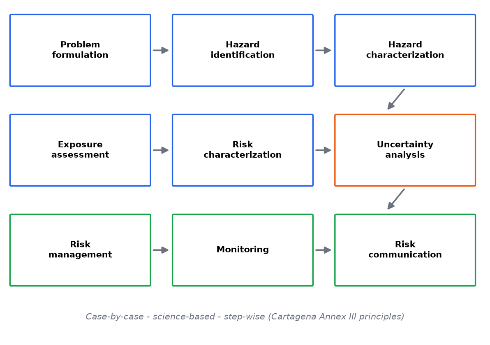

# Module 3 — The GMO Environmental Risk-Assessment Framework

**Level:** Beginner → Intermediate

---

## Learning objectives

1. Reproduce the full ERA workflow from problem formulation to risk communication, with the purpose of each stage.
2. For every stage, specify inputs, questions asked, data required, methods, outputs, limitations, and an example.
3. Explain why **problem formulation** controls the quality of everything downstream.
4. Distinguish scientific assessment outputs from management and decision outputs.

---

## Definition

The environmental risk-assessment framework is the staged procedure by which a release question is turned into a defensible, uncertainty-aware conclusion. Its canonical stages:

```text
Problem Formulation
      ↓
Hazard Identification
      ↓
Hazard Characterization
      ↓
Exposure Assessment
      ↓
Risk Characterization
      ↓
Uncertainty Analysis
      ↓
Risk Management        (decision space)
      ↓
Monitoring             (feedback)
      ↓
Risk Communication     (throughout)
```

Modern frameworks (Codex, Cartagena lineage, EFSA, US agencies) differ in naming and legal detail but share this logical spine. *(See [Module 22](../../risk/modules/22-Regulatory-Frameworks.md) for the frameworks themselves.)*

## Why it matters

Without staging, assessment degenerates into argument: everyone debates conclusions before agreeing what question is being asked. The framework forces explicit questions in a fixed order, makes every assumption reviewable, and separates *what the science says* from *what society decides*.

## Beginner explanation

Think of it as a hospital diagnostic pathway: triage (problem formulation), symptom review (hazard identification), diagnostic tests (characterization/exposure), diagnosis (risk characterization), second opinion on uncertainty, treatment options (management), follow-up appointments (monitoring), and explaining it all clearly to the patient (communication).

## Scientific explanation — stage by stage

### 3.1 Problem formulation

| Aspect | Content |
|---|---|
| **Purpose** | Convert "assess this GMO" into a finite set of analyzable questions; define scope, protection goals, comparators, and assessment endpoints |
| **Inputs** | Trait description; organism biology; intended receiving environment; regulatory information requirements; protection goals of the jurisdiction |
| **Questions asked** | What values are we protecting (e.g., non-pest insect populations, soil function, wild-relative genetic integrity)? What plausible pathways could connect this GMO to harm of those values? Which pathways are *worth analyzing*? What is the right comparator (conventional counterpart, common practice)? |
| **Data required** | Organism/trait dossiers; knowledge of receiving environment; pathway hypotheses |
| **Scientific methods** | Pathway-of-harm diagramming; literature synthesis; expert elicitation; familiarity analysis |
| **Expected outputs** | Assessment plan: analysis endpoints, methodology, data requirements; explicit list of pathways *not* pursued and why |
| **Limitations** | Protection goals are partly value judgments; pathway triage can prematurely discard pathways; comparator choice is consequential and contestable |
| **Example** | Bt cotton release: protection goals include non-target biodiversity and resistance sustainability; pathways: exposure of non-target Lepidoptera via pollen; selection for resistance in target pest; compositional feed effects; the "vertical transfer via predator" pathway kept; "gene flow to wild relatives" deprioritized because no compatible relatives within 500 km |

**Why this stage controls everything:** a risk assessment answers the questions it asks. If problem formulation forgets a pathway (e.g., debris-borne exposure in streams), no later technical brilliance recovers it.

### 3.2 Hazard identification

| Aspect | Content |
|---|---|
| **Purpose** | Enumerate *what could* cause harm — no probability yet |
| **Inputs** | Molecular characterization (Module 4); novel product identity; trait function; known biology of the organism |
| **Questions asked** | What new products/functions exist? What is known about their effects? What phenotypes changed? |
| **Data required** | Insert/construct characterization; protein identity & mode of action; comparative phenotype data; compositional data |
| **Methods** | Bioinformatics comparisons to known toxins/allergens; mode-of-action studies; targeted hazard tests; literature on similar traits |
| **Outputs** | Hazard catalogue with mechanisms: "protein P active in insect order O"; "trait alters seed dormancy"; "herbicide regimen selects weeds" |
| **Limitations** | Cannot prove absence of hazards; identification is hypothesis generation, not risk conclusion |
| **Example** | HT soybean: hazard list = novel protein (assessed benign), herbicide regimen (weed selection; farmland flora), altered volunteer control |

### 3.3 Hazard characterization

| Aspect | Content |
|---|---|
| **Purpose** | For each identified hazard: describe the dose/effect relationship and mechanism in the entities that matter |
| **Questions asked** | At what doses does the effect occur? Which species/stages are sensitive? What is the mode of action? |
| **Data required** | Laboratory dose-response tests on representative species; mode-of-action confirmation; in vitro specificity studies |
| **Methods** | Bioassays (oral, dietary); dose-response fitting (IC50/NOAEL/BMD); structural comparisons |
| **Outputs** | Quantitative or ranked hazard profiles per species/pathway |
| **Limitations** | Lab conditions ≠ field; species selection is a judgment; chronic/multigenerational effects underpowered |
| **Example** | Cry protein: dose-response for a non-target lepidopteran (LC50 at X ng/cm² diet); no measurable activity for predator species tested |

### 3.4 Exposure assessment

| Aspect | Content |
|---|---|
| **Purpose** | Determine the magnitude, frequency, and duration of contact between hazard and valued entities |
| **Questions asked** | Who is exposed, via which route (pollen, tissue, debris, exudates, soil, water), at what level, for how long? |
| **Data required** | Expression levels by tissue/stage; environmental fate (Module 13); species' behavior/diet; spatial arrangement (fields, margins, water); climate |
| **Methods** | Environmental monitoring/measurement; fate & decay modeling; dietary exposure modeling; landscape GIS analysis; scenario simulation |
| **Outputs** | Exposure profiles per pathway: point estimates, distributions, or bounding scenarios |
| **Limitations** | Highly context-dependent; worst-case scenarios can be physically unrealistic; long-term/landscape exposure extrapolation is model-heavy |
| **Example** | Bt maize pollen: peak expression at anthesis; measured deposition gradient with distance; larval feeding window overlaps (or not) anthesis → exposure magnitude per larva |

### 3.5 Risk characterization

| Aspect | Content |
|---|---|
| **Purpose** | Integrate hazard, exposure, dose-response, and context into conclusions per pathway |
| **Questions asked** | How likely is harm, how severe, to which endpoints, with what confidence? |
| **Data required** | Everything above |
| **Methods** | Risk quotient (PEC/PEC-against-PNEC style ratios); tiered testing (lab → field); weight of evidence; probabilistic simulation; qualitative banding |
| **Outputs** | Risk statements per pathway with uncertainty annotations: "Risk of effect on larval populations under standard management is negligible-to-low (confidence: moderate); under delayed-sowing scenario, low-to-moderate" |
| **Limitations** | Integration method embeds judgment; ratios hide variance; "negligible" needs operational definition |
| **Example** | Combining Exercises 7–8 of [DATA](../../risk/index.md): environmental concentrations ≪ IC50 for insensitive predators → negligible direct risk; sensitive lepidopteran larvae feeding on contaminated host plants near fields → pathway retained for management/monitoring |

*(Full treatment: [Module 17](../../risk/modules/17-Risk-Characterization.md).)*

### 3.6 Uncertainty analysis

| Aspect | Content |
|---|---|
| **Purpose** | Characterize what is unknown: parameter, model, scenario, and structural uncertainty |
| **Questions asked** | Which inputs drive conclusions? How would reasonable alternative assumptions change them? |
| **Data required** | Variability in all measurements; model assumptions; expert judgment |
| **Methods** | Sensitivity analysis; Monte Carlo; scenario analysis; qualitative uncertainty matrices (Module 16 §4) |
| **Outputs** | Uncertainty statement attached to every risk conclusion; priority list for new data |
| **Limitations** | Communicating uncertainty without eroding trust is a skill (Module 21); uncertainty ≠ ignorance, it is quantifiable to a point |
| **Example** | Exercise 10 ([DATA](../../risk/index.md)): toy gene-flow model output varies 4 orders of magnitude across plausible inputs; isolation distance dominates variance *in that parameterization* |

### 3.7 Risk management

| Aspect | Content |
|---|---|
| **Purpose** | Decide what to do about characterized risks — reduce, contain, accept with monitoring, or refuse |
| **Questions asked** | Which measures cut exposure or hazard most cost-effectively? What is acceptable? Who bears residual risk? |
| **Data required** | Risk characterization; effectiveness data for measures (refuges, isolation distances, stewardship); compliance realities |
| **Methods** | Options analysis; cost-benefit and cost-effectiveness; stakeholder consultation (policy side) |
| **Outputs** | Management plan: refuges, buffers, stewardship programs, approval conditions, refusal |
| **Limitations** | Effectiveness depends on human compliance (S23 in the risk matrix!); management is where values enter openly |
| **Example** | 20% structured refuge + resistance monitoring + stewardship training attached to a Bt maize approval |

*(Full treatment: [Module 18](../../risk/modules/18-Risk-Management.md). Assessment ≠ management — keep them visibly distinct.)*

### 3.8 Monitoring

| Aspect | Content |
|---|---|
| **Purpose** | Test the assessment's assumptions after release; detect change; trigger management response |
| **Questions asked** | Are assumed exposures/ex Effects appearing? Is resistance frequency rising? Any baseline shifts? |
| **Data required** | Baseline (pre-release) data; indicator definitions; statistical power to detect change |
| **Methods** | Surveillance networks; resistance bioassays; gene-flow surveys; indicator sampling designs (Modules 19–20) |
| **Outputs** | Monitoring reports; trigger evaluations; adaptive-management adjustments |
| **Limitations** | Detecting small changes at landscape scale is statistically hard; funding typically decays post-approval |
| **Example** | Annual F2-screen of target pest for resistance allele frequency; trigger = frequency band requiring stewardship response |

### 3.9 Risk communication

Runs through every stage, not after them. Two-way: informing stakeholders and receiving their knowledge (including local ecological knowledge that reshapes problem formulation). *(Full treatment: [Module 21](../../risk/modules/21-Risk-Communication.md).)*

## The tiered-testing logic

Most frameworks economize assessment with tiers:

```text
Tier 1  worst-case / conservative lab tests
          ↓  (if margin of safety large → conclude; else)
Tier 2  realistic lab / semi-field (cages, mesocosms)
          ↓
Tier 3  field studies, landscape scale
```

Conservative Tier-1 tests *screen*: a large safety margin at exaggerated exposure ends inquiry efficiently; a hint of effect escalates to realistic conditions. This is how limited resources concentrate where risk is plausible — and why "the lab study found an effect" headlines usually describe Tier-1 screens, not field conclusions.

## Worked mini-example (threading one pathway through all stages)

**Pathway:** Bt maize pollen → larval host plant on field margin → larval mortality.

1. **Problem formulation:** endpoint = margin-dwelling lepidopteran populations; pathway plausible where host plants flower within pollen-drift range.
2. **Hazard identification:** Cry protein active on susceptible Lepidoptera (lab).
3. **Hazard characterization:** dose-response for representative species (Lab 08 dataset).
4. **Exposure assessment:** anthesis timing vs larval feeding; pollen deposition gradient (Module 13); host-plant density in margins.
5. **Risk characterization:** compare exposure dose to dose-response → risk statement per scenario (early/late sowing).
6. **Uncertainty:** species sensitivity coverage; deposition model assumptions; landscape variation.
7. **Management:** margin management guidelines; sowing-date advisories; monitoring of indicator larvae.
8. **Communication:** publish assessment + monitoring data; explain numbers with uncertainties in public materials.

## Common misconceptions

| Misconception | Reality |
|---|---|
| "The framework is a checklist; complete it and you're done" | It's a reasoning scaffold; quality lives in the questions and evidence, not boxes ticked |
| "More stages = more safety" | A poorly formulated pathway list corrupts everything downstream |
| "Risk characterization is the end" | Management, monitoring, and communication complete the cycle |
| "Tier 1 lab effect = environmental risk" | Tiers escalate; Tier-1 is a screen with exaggerated exposure |

## Exam points

- Reproduce the framework and give one input/output per stage.
- Argue why problem formulation is the highest-leverage stage.
- Explain tiered testing and what a Tier-1 result does and does not establish.
- Distinguish assessment outputs from management outputs with an example.

## Figures

<figure markdown>


*Figure - The environmental risk-assessment framework from problem formulation to risk communication.*
</figure>


## Quick-check questions

1. Write the problem formulation for a GM forest tree release: choose three protection goals and two analysis pathways you would keep, one you would deprioritize, with reasons.
2. Which stage would catch a scenario forgotten at problem formulation? What if it never enters the list?
3. Give one example where exposure data change a hazard's regulatory priority from high to negligible.
4. Why does monitoring feed back to problem formulation?
5. Map the four GMO classes from Module 2 onto the framework: which stages shrink or grow for each?

---

*Next: [Module 4 — Molecular Characterization](../../risk/modules/04-Molecular-Characterization.md): the evidence base that starts every assessment.*---

## What you should know

Review the learning objectives and quick-check questions above. Then continue the sequence.

## What you should be able to do

- Test yourself with the [multiple-choice questions](../assessment/MCQs.md) and the [short-answer](../assessment/Short-Questions.md) and [long-answer](../assessment/Long-Questions.md) banks.
- Instructors: model answers are in the [answer key](../assessment/Answer-Key.md).
- Quick revision: [cheat sheet](../guide/cheat-sheet.md) and [FAQs](../guide/faqs.md).
- Hands-on practice: the [practical program overview](../labs/index.md).

[<- Hazard, Risk and Exposure](../modules/02-Hazard-Risk-and-Exposure.md) &middot; [Course home](../index.md) &middot; [Continue to next module ->](../modules/04-Molecular-Characterization.md)
