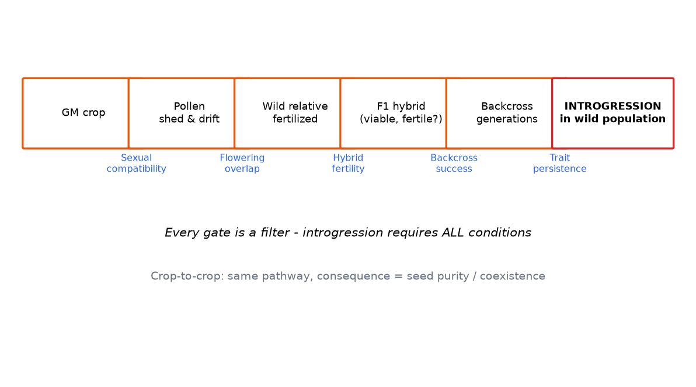

# Module 6 — Gene Flow and Introgression

**Level:** Intermediate

---

## Learning objectives

1. Define gene flow, hybridization, and introgression, and order them as a sequence of filters.
2. Distinguish crop-to-crop from crop-to-wild-relative gene flow and their different risk questions.
3. List the biological and contextual factors that determine whether gene flow occurs at all.
4. Interpret gene-flow data (frequency vs distance studies) and connect them to management options.

---

## Definition

**Gene flow** is the movement of genes between populations — via pollen, seed, or vegetative propagation. **Hybridization** is the successful crossing that produces mixed offspring. **Introgression** is the *permanent incorporation* of a gene into a recipient population's gene pool through repeated backcrossing. Gene flow is the event; introgression is the outcome that matters most for long-term risk.

## Why it matters

A GM trait confined to the intended crop can still be assessed by crop-level ecology. A trait that *escapes* into other crops (seed purity issues) or wild populations (novel ecological capability in a new species) extends the risk question in space, time, and reversibility. Introgression into wild relatives is largely irreversible — the reason gene flow sits near the top of every ERA pathway list (Module 3 §3.1).

## Beginner explanation

Pollen is a plant's messenger service. Wind-pollinated crops send it far and wide; insect-pollinated crops deliver it to wherever the pollinator goes; a little always gets further than average. If that pollen lands on a compatible flower, a hybrid seed can form. If that hybrid survives, backcrosses to the wild population over generations, and the gene sticks — that is introgression. Three doors must all open: distance, compatibility, persistence.

## Scientific explanation

### 6.1 The filter sequence

```text
GM pollen/seed produced
   → FILTER 1: dispersal (distance, direction, viability)
   → FILTER 2: reproduction (compatible receptor? synchrony? hybrid viable?)
   → FILTER 3: establishment (hybrid survives, backcrosses)
   → FILTER 4: introgression (gene maintained, selected for/against)
   → ECOLOGICAL CONSEQUENCE? (does the trait change the recipient's ecology?)
```

Each filter multiplies. If any filter is effectively zero (no compatible relatives within realistic dispersal; no flowering synchrony), the pathway closes — this is the structure of every gene-flow argument in an ERA.

### 6.2 What determines each filter

| Filter | Determining factors |
|---|---|
| Dispersal | pollination mode (wind/insect/self), pollen longevity, field size & geometry, wind patterns, topography; seed dispersal machinery, harvest/transport losses |
| Reproduction | presence & distance of compatible relatives (same species = trivially compatible; wild relatives = species complex specific), flowering synchrony, sexual compatibility, ploidy barriers, direction of cross |
| Establishment | hybrid fitness, habitat availability, competition, herbivory |
| Introgression | backcross viability, chromosomal pairing, linkage (is the trait linked to wild-type-fitness loci?), selection on the trait in the wild context |

### 6.3 Crop-to-crop vs crop-to-wild

| Aspect | Crop → crop | Crop → wild relative |
|---|---|---|
| Compatibility | High (same or adjacent species) | Species-complex specific; often reduced by ploidy/domestication barriers |
| Typical concern | seed-channel purity; stacked-trait volunteers; resistance selection in volunteers | novel ecological capability in wild populations; irreversibility |
| Detectability | straightforward (marker screening of seed lots) | requires surveys of wild populations |
| Management | isolation distances, border rows, scheduling, varietal registration | spatial planning (no-grow zones), trait choice (e.g., non-flowering designs), monitoring |

### 6.4 Reading gene-flow data

Field studies (like the simulated one in [DATA/gene-flow](../downloads/gene-flow.md), Lab 03) typically screen thousands to tens of thousands of offspring at a series of distances from a pollen source, yielding frequency-vs-distance curves:

- Frequencies at 1 m may be orders of magnitude higher than at 50–100 m; long tails are low but rarely zero.
- Interpret with: the *absolute* denominator (1 in 5,000 vs 1 in 500,000 matters differently for a wild population of 10⁶ plants), the *replicate spread*, and the *model* used to interpolate beyond measured distances.
- A frequency is not yet a risk: multiply by receptor availability, then ask what the trait would do ecologically (Module 7 for fitness consequences).

### 6.5 Modeling (conceptual)

Assessors combine:
- **Exponential/power-law decay models** of pollen deposition with distance (parameters from measurement),
- **Landscape layers** (relative-area of compatible recipients),
- **Fitness models** for what introgressed trait would do (neutral? advantage? cost?),
- **Population-genetic dynamics** of introgression over generations (selection coefficient matters more than the initial hybrid rate — a trait costing fitness may introgress nowhere; a neutral trait can drift; a beneficial trait sweeps) (Module 25 §2).

## Step-by-step workflow: assessing a gene-flow pathway

```text
1. Inventory compatible recipients (same species crops; wild relatives; map distances)
2. Characterize dispersal biology (pollination mode; pollen longevity; seed machinery)
3. Check reproductive barriers (synchrony, ploidy, compatibility)
4. Quantify hybrid formation (field data or literature for the species complex)
5. Model establishment & introgression (trait fitness in recipient context)
6. Characterize ecological consequence IF introgressed (trait function vs recipient ecology)
7. Combine → risk statement (pathway band + uncertainty)
8. Management options: spatial isolation, flowering-time shifts, border rows,
   trait design (male sterility, chloroplast inheritance where applicable), monitoring
```

## Example data

From the simulated pollen-flow study ([DATA/gene-flow/pollen_flow_distance.csv](../../assets/risk/DATA/gene-flow/pollen_flow_distance.csv); 8 distances × 5 replicates × ~40,000 seeds screened):

| Distance | Mean flow frequency | Reading |
|---|---|---|
| 1 m | ~2.5 × 10⁻² | adjacent-field maximal exposure |
| 10 m | ~1.2 × 10⁻² | steep early decline |
| 50 m | ~5 × 10⁻⁴ | isolation-distance territory |
| 100 m | ~1.9 × 10⁻⁴ (1 in ~5,400 seeds) | low but nonzero |
| 200 m | ~1.6 × 10⁻⁴ | long tail: not zero |

Log-log analysis gives a steep slope (~ −1.1, r ≈ −0.93) — but the correct ERA reading is *not* "100 m is safe"; it is "frequency is bounded, exposure depends on receptor area, consequence depends on trait fitness" (Lab 03 walks the full chain).

## Figures

<figure markdown>


*Figure - The introgression pathway: every gate from sexual compatibility to trait persistence must pass.*
</figure>

<figure markdown>


*Figure - Pollen-mediated gene flow decays with distance; buffer zones act on the steep segment of the curve.*
</figure>


## Interpretation

- Gene flow is *common*; introgression with consequence is *rare and conditional*.
- The pathway's risk lives in the **consequence** step: a neutral trait introgressing at low frequency differs categorically from a dormancy-increasing trait doing so.
- Management is layered: no single measure (distance alone, scheduling alone) achieves zero; the question is which combination achieves acceptably low values *for the trait's consequence profile*.

## Common misconceptions

| Misconception | Reality |
|---|---|
| "Gene flow = wild GMO takeover" | Most flow events die at filters 2–3; introgression requires repeated backcrossing + trait maintenance |
| "Zero outcrossing at distance X is achievable" | Tails persist; management reduces frequency, rarely to mathematical zero |
| "If hybrids form, risk is realized" | Hybrid formation ≠ establishment ≠ introgression ≠ ecological consequence |
| "Self-pollinating crops have no gene flow" | Reduced, not zero: rare outcrossing + seed movement still matter (rates differ by orders of magnitude, case-by-case) |

## Exam points

- Recite the four-filter sequence with one determining factor each.
- Contrast crop-to-crop and crop-to-wild concerns and managements.
- Interpret a frequency-vs-distance table: state what additional data convert it into a risk statement.
- Name three management layers for gene flow and their limits.

## Quick-check questions

1. A wind-pollinated outcrossing crop vs a selfing crop: which filter differs most? Consequence for isolation-distance recommendations?
2. Trait T increases seed dormancy 20% in a wild relative. Trace the filter sequence and state at which step the risk question actually lives.
3. Why can a *fitness-costing* trait introgress less than a *neutral* one? What does that imply about herbicide-tolerance traits in the absence of herbicide?
4. From the table above: receptor population of 2 × 10⁶ plants, trait neutral — how many introgressed alleles would you *expect* at 100 m, and what further question decides whether that matters?
5. Design a three-layer management package for a regional seed-purity concern.

---

*Next: [Module 7 — Persistence, Weediness and Invasiveness](../../risk/modules/07-Persistence-Weediness-and-Invasiveness.md): what happens to the GM plant itself beyond the field.*---

## What you should know

Review the learning objectives and quick-check questions above. Then continue the sequence.

## What you should be able to do

- Test yourself with the [multiple-choice questions](../assessment/MCQs.md) and the [short-answer](../assessment/Short-Questions.md) and [long-answer](../assessment/Long-Questions.md) banks.
- Instructors: model answers are in the [answer key](../assessment/Answer-Key.md).
- Quick revision: [cheat sheet](../guide/cheat-sheet.md) and [FAQs](../guide/faqs.md).
- Hands-on practice: the [practical program overview](../labs/index.md).

[<- Phenotypic and Compositional Assessment](../modules/05-Phenotypic-and-Compositional-Assessment.md) &middot; [Course home](../index.md) &middot; [Continue to next module ->](../modules/07-Persistence-Weediness-and-Invasiveness.md)
