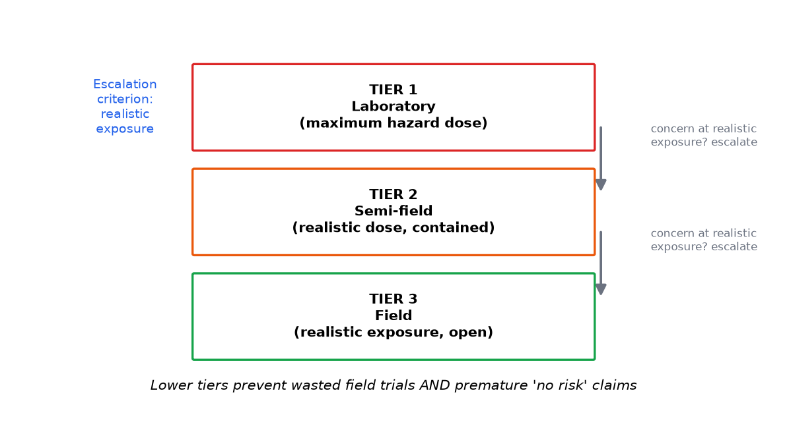

# Module 8 — Non-Target Organisms

**Level:** Intermediate

---

## Learning objectives

1. Enumerate the non-target groups assessment must consider and why each matters.
2. Distinguish **direct**, **indirect**, and **trophic** effects with concrete mechanisms.
3. Map exposure pathways for non-targets and explain why route determines dose.
4. Apply the tiered (lab → semi-field → field) evidence structure and interpret each tier's limits.
5. Use the Bt-crop literature as the master case study for how this assessment actually unfolds.

---

## Definition

**Non-target organisms (NTOs)** are all organisms in the receiving environment other than the intended pest target — pollinators, natural enemies (predators, parasitoids), soil and decomposer organisms, aquatic organisms, birds, mammals, and non-pest herbivores. **Non-target assessment** asks whether the GMO (or its management system) could harm any of them.

## Why it matters

The environmental case for Bt-type traits rests on *selectivity* — toxicity to target pests, safety for everything else. That claim is empirical, not definitional: it must be tested group by group. Natural enemies and pollinators are also pest-suppression and food-production assets (ecosystem services, Module 10), so their protection is both an ecological and an economic requirement.

## Beginner explanation

A new insecticide — including one made by the plant itself — must answer for every insect, mite, bird and worm that wasn't the target. Imagine a new fly spray: does it hurt bees? What about the ladybirds eating aphids? What about the earthworms under the carpet of leaves? Each needs its own look, because "insects" is not one biology.

## Scientific explanation

### 8.1 The groups and their functions

| Group | Examples | Why assessed |
|---|---|---|
| Pollinators | honeybees, bumblebees, solitary bees | pollination services; regulatory sentinel species |
| Predators | ladybirds, lacewings, ground beetles, spiders | biological pest suppression |
| Parasitoids | braconid/ichneumonid wasps | pest suppression; high trophic sensitivity |
| Soil organisms | earthworms, springtails, mites, nematodes, microbes | decomposition, nutrient cycling (Module 9) |
| Aquatic organisms | caddisflies, detritivores in streams | crop-debris pathway (Module 13) |
| Non-pest herbivores | butterflies (milkweed-type larvae), leafhoppers | conservation + food-web connectivity |
| Birds & mammals | granivores, insectivores | seed/protein exposure; public salience |

### 8.2 Direct, indirect, and trophic effects

| Type | Mechanism | Example shape |
|---|---|---|
| **Direct** | organism ingests/contact the active protein and is affected | susceptible lepidopteran larva eats Bt tissue → gut binding → mortality |
| **Indirect (plant-mediated)** | the GM plant's *changed management* affects the organism | less broad-spectrum insecticide sprayed in Bt fields → more natural enemies than in sprayed conventional fields |
| **Trophic** | effect transmitted through the food chain | predator eats a sub-lethally affected herbivore (quality/quantity of prey changes); parasitoid develops in intoxicated host |

Trophic effects are the subtlest: they do not require the predator to be sensitive to the protein at all, only that its *prey* changes. Assessment therefore asks both "is the predator sensitive?" and "what happens to its prey?" (see the lacewing-parasitoid debates in the Bt literature for how contested these lines can be).

### 8.3 Exposure pathways (route determines dose)

```text
Bt crop plant
   ├── pollen → flower visitors; larvae on margin host plants (anthesis-timed)
   ├── plant tissue → chewing herbivores (non-pest Lepidoptera etc.)
   ├── root exudates/soil → soil invertebrates (usually minuscule doses)
   ├── debris → aquatic shredders, detritivores (longest-lasting compartment)
   └── contaminated prey → predators, parasitoids (trophic route)
```

Each pathway has its own magnitude–duration profile (Module 13 quantifies this). A species eating only pollen at 1.5 ng/g faces different exposure than a debris-feeding aquatic larva at 40+ ng/g over months.

### Figures

<figure markdown>


*Figure - Tiered non-target testing: escalate only on concern at realistic exposure.*
</figure>


## 8.4 Tiered evidence structure

| Tier | Design | What it can establish |
|---|---|---|
| 1 — Lab | worst-case: purified protein or high-expressing tissue fed directly, often at 10×+ field rates; sentinel species per group | whether a hazard exists at extreme exposure; dose-response (Module 2 §2.1) |
| 2 — Semi-field | caged realistic exposure: actual plant tissue/pollen at realistic doses; multi-life-stage | effects under controlled realistic conditions; behavior-mediated exposure |
| 3 — Field | open plots, farm-scale; population/community metrics | net effects in context — including *indirect* effects of changed management |

**Interpretation rules:**
- A clean Tier 1 with a large safety margin (exposure ≪ effect threshold) can close a pathway — that's the tier system saving resources.
- A Tier-1 hint of effect does *not* establish environmental risk; it escalates to Tier 2/3 where realism lives.
- Field studies measure *net* effect: they integrate direct harms and indirect benefits (e.g., removed insecticide sprays) and therefore can look "better" than sprayed counterparts while a direct pathway still exists at low level.

### 8.5 The Bt master case study (canonical structure)

1. **Selectivity basis:** mode of action (midgut receptor binding in susceptible orders) — mechanism predicts narrow spectrum; confirmed by in-vitro + feeding tests across groups.
2. **Sentinel testing:** standard suites (honeybee larva/adult, ladybird, lacewing, parasitoid, earthworm, springtail, collembola…) at exaggerated doses.
3. **The monarch episode (1999):** lab finding — pollen dusted onto milkweed affected larvae — triggered the field question: *what is real exposure?* Answer came from multi-year, multi-site studies: deposition, feeding behavior, and typical management made population-level risk from standard Bt maize low (some pollen types higher-expressing in pollen than others — trait design mattered). This is the clearest public demonstration that hazard identification ≠ risk characterization.
4. **Indirect effects reality:** Bt fields typically carry more invertebrate biodiversity than insecticide-sprayed conventional fields — the comparison baseline *is the alternative practice*, a recurring theme (Module 16 §5).
5. **Continuing watch:** debris/stream pathway; stacked-trait combinations; resistance-driven changes in toxin dose (Module 11).

## Example data

From [DATA/non-target/nontarget_survival.csv](../../assets/risk/DATA/non-target/nontarget_survival.csv) (simulated; 5 species × 2 treatments × replicates):

| Species | Control survival | Bt-pollen survival | z (two-proportion) | Reading |
|---|---|---|---|---|
| honeybee adult | 0.833 | 0.867 | +0.36 | within cage variation |
| ladybeetle adult | 0.933 | 0.900 | −0.47 | within cage variation |
| lacewing larva | 0.867 | 0.800 | −0.69 | largest dip; still n.s.; note power |
| parasitoid wasp | 0.867 | 0.900 | +0.40 | no signal |
| springtail | 0.967 | 1.000 | +1.01 | no signal |

Lab 04 walks the correct inference: no direct-toxicity signal at this design's power; the honest conclusion bounds effects for *these species, this exposure, this duration* — it does not certify all non-targets everywhere (Module 16 §3).

## Interpretation

- Route and magnitude first: the same protein at 1.5 (pollen) vs 40 (debris) ng/g are different risk conversations.
- Sentinel species are surrogates; their coverage has limits (Module 16 §3).
- Net field effects include management-system comparisons — "better than the sprayed alternative" and "small direct pathway exists" can both be true; risk characterization reports both.

## Common misconceptions

| Misconception | Reality |
|---|---|
| "Bt harms all insects" | Mode of action is order-selective; broad claims contradict the mechanism |
| "One lab study settles it" | Tiers exist precisely because lab ≠ field; exposure realism decides |
| "Non-target effects = only the protein's toxicity" | Management changes (fewer sprays) are equally real effects — often dominant |
| "Predators are safe if they aren't sensitive" | Trophic effects can act through prey quality/availability |

## Exam points

- Classify a described effect as direct/indirect/trophic and justify.
- Explain what each tier can and cannot establish.
- Reconstruct the monarch episode in hazard/exposure/risk vocabulary.
- Interpret a non-target survival table with correct attention to power and coverage limits.

## Quick-check questions

1. A parasitoid declines in Bt fields. Name three candidate mechanisms (direct, trophic, indirect) and one study design distinguishing them.
2. Why can Tier 1 close a pathway but rarely open a regulation by itself?
3. Which non-target group would you prioritize for a debris-heavy irrigation-return stream, and why?
4. In the simulated table above, lacewing larvae show the largest (still n.s.) dip. What follow-up design quantifies whether a small effect exists?
5. Why is "no effect on sentinels" weaker evidence than "exposure is 100× below the effect threshold"?

---

*Next: [Module 9 — Soil Ecosystems and Microbial Interactions](../../risk/modules/09-Soil-Ecosystems-and-Microbial-Interactions.md): below-ground ecology and the hardest detection problems.*---

## What you should know

Review the learning objectives and quick-check questions above. Then continue the sequence.

## What you should be able to do

- Test yourself with the [multiple-choice questions](../assessment/MCQs.md) and the [short-answer](../assessment/Short-Questions.md) and [long-answer](../assessment/Long-Questions.md) banks.
- Instructors: model answers are in the [answer key](../assessment/Answer-Key.md).
- Quick revision: [cheat sheet](../guide/cheat-sheet.md) and [FAQs](../guide/faqs.md).
- Hands-on practice: the [practical program overview](../labs/index.md).

[<- Persistence, Weediness and Invasiveness](../modules/07-Persistence-Weediness-and-Invasiveness.md) &middot; [Course home](../index.md) &middot; [Continue to next module ->](../modules/09-Soil-Ecosystems-and-Microbial-Interactions.md)
