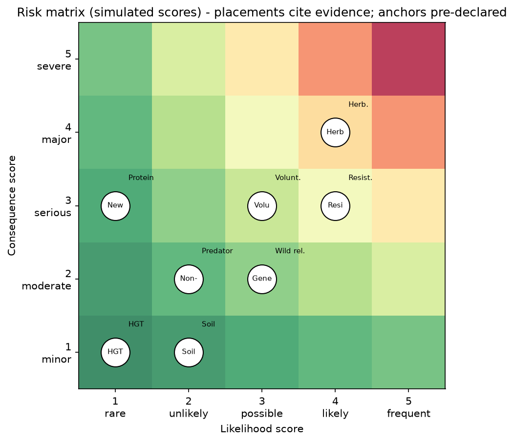

# Module 17 — Risk Characterization

**Level:** Advanced

---

## Learning objectives

1. Define risk characterization as the integration stage of the framework (Module 3 §3.5) and its outputs.
2. Apply qualitative (banding/matrix) and quantitative (risk quotient, probabilistic) approaches, knowing when each is appropriate.
3. Draft a complete risk statement with hazard, exposure, consequence, uncertainty, and confidence.
4. Explain how uncertainty analysis (Module 16) attaches to characterization outputs.

---

## Definition

**Risk characterization** integrates hazard, exposure, dose-response, and ecological context into conclusions about the likelihood and severity of harm — with explicit uncertainty — for each assessed pathway. It is the assessment's *output layer*: everything upstream exists to make this stage defensible.

## Why it matters

Characterization is where scientific work becomes decision-relevant. Done well: decision-makers see per-pathway conclusions, bands, confidence, and data-priority lists. Done badly: single-word verdicts ("safe"/"dangerous") that hide assumptions and invite both misuse and distrust.

## Beginner explanation

You have two facts: the dose that harms (hazard) and the dose actually received (exposure). Risk characterization is the conversation between them — plus honesty about both numbers' fuzziness. Big margin between them → low concern. Slim or negative margin → concern, with specifics. Then the same logic, in percentages for chemical doses or ordinal bands for ecological endpoints.

## Scientific explanation

### 17.1 The integration formula-space

```text
Hazard evidence      (dose-response, mechanism, affected taxa)
 + Exposure evidence (route, magnitude, frequency, duration)
 + Dose-response     (thresholds, slopes)
 + Ecological context(community, baseline, comparison practice)
 + Uncertainty       (types, sensitivities, gaps)
 ↓
RISK CHARACTERIZATION  per pathway:
   likelihood band × consequence band (qualitative)
   or margin/ratio (quantitative)
   or probability distribution (probabilistic)
   + confidence level + residual unknowns
```

### 17.2 Qualitative approaches

**Matrix banding (5×5):** likelihood (rare → almost certain) × consequence (negligible → severe) → risk score 1–25, banded Low/Medium/High/Very-high ([DATA/risk-matrix](../downloads/risk-matrix.md), Lab 09). Strengths: transparent, communicable, decision-ready. Limits: **bands are conventions, not measurements** — a 4→5 likelihood jump can move two bands; scoring rationale must accompany every score; sensitivity checks are mandatory (Exercise 10).

**Narrative weight-of-evidence:** structured prose integrating concordant/discordant lines — the mode most ecological assessments actually use. Discipline: parallel structure per pathway (hazard → exposure → integration → uncertainty), so conclusions are comparable.

### 17.3 Quantitative approaches

**Risk quotient (RQ):** `RQ = PEC / PNEC` (predicted environmental concentration ÷ predicted no-effect concentration). Rules of thumb (conventions vary by framework): RQ ≪ 1 → low concern; RQ ≈ 1 → attention; RQ ≫ 1 → concern/mitigation. Strength: forces both sides to be numbers; margin is visible. Limits: hides variance (a distribution divided into a point), assumes the effect threshold is well estimated.

**Margin-of-exposure (MOE):** threshold ÷ intake (Module 15 §15.2) — same logic, human-health vocabulary.

**Probabilistic characterization:** propagate input *distributions* (Monte Carlo, as in [DATA/uncertainty](../downloads/uncertainty.md)) → output distribution → "P(RQ>1) = x%" style statements. Strength: variance becomes visible; the 95th percentile has meaning. Limits: demands distribution data that ecology rarely has; models become the risk (model uncertainty, Module 16 §16.4).

**Tiered-conditional logic:** characterization at each tier either closes the pathway (large margin under bounding exposure) or escalates. Most pathways close at Tier 1; the few that don't receive the deep evidence budget — the framework's economy.

### 17.4 Drafting the risk statement (the core skill)

Required elements:
1. **Pathway** named specifically (trait → route → receptor)
2. **Hazard** characterization (threshold/magnitude basis)
3. **Exposure** basis (measured/modeled; realistic vs bounding)
4. **Conclusion:** likelihood × consequence (or RQ/MOE)
5. **Uncertainty:** types, sensitivities, confidence level
6. **Management linkage:** what would change the conclusion

Template:

> "Risk of [harm H] to [receptor V] via [route R] under [scenario S] is [band/estimate], based on [hazard evidence] and [exposure basis]. Confidence is [high/moderate/low]; dominant uncertainties are [list]. This conclusion would change if [assumption] fails; monitoring for [indicator] at [trigger] is recommended."

### 17.5 Worked example (assembling course datasets)

**Pathway:** Bt pollen → margin host-plant → sensitive lepidopteran larvae.

| Input | Source | Value (simulated) |
|---|---|---|
| Hazard threshold | [DATA/dose-response](../downloads/dose-response.md) | IC50 ≈ 42 ng/cm² (sensitive-species proxy) |
| Exposure: pollen deposit on adjacent flora | [DATA/exposure](../downloads/exposure.md) + deposition model | ≪ 1 ng/cm² realistic; bounding ≈ few ng/cm² |
| Margin | — | ≥ 10× even at bounding |
| Matrix | — | likelihood low-moderate × consequence low-moderate → **Low-Medium band** |
| Uncertainty | species sensitivity coverage; deposition variance | moderate confidence; monitoring trigger set |

Contrast pathway (resistance, no refuge): likelihood high × consequence high → **Very high band**; management mandatory (Module 18). The framework's value: it makes the *comparison* between pathways possible and defensible.

### 17.6 Aggregation and prioritization

Per-pathway characterizations roll up into a release-level summary: closed pathways (with margins), open pathways (with bands + management), data-priority list (from sensitivity). This is the document a regulator actually reads (Module 22).

## Figures

<figure markdown>


*Figure - A qualitative risk matrix with pre-declared likelihood and consequence anchors.*
</figure>


## Interpretation

- Characterization inherits every upstream weakness — hence problem formulation's leverage (Module 3 §3.1).
- Bands/ratios are decision *conventions*; their defensibility lives in the documented rationale and sensitivity, not the arithmetic.
- Confidence language is part of the result, not decoration.

## Common misconceptions

| Misconception | Reality |
|---|---|
| "Risk = one number" | A characterization is band/estimate + confidence + assumptions |
| "Quantitative beats qualitative, always" | Ecological data often can't bear probability math; qualitative rigor > false precision |
| "All pathways need equal depth" | Tiering concentrates evidence where margins are thin |
| "Once characterized, done" | Monitoring + adaptive revision are part of the characterization lifecycle |

## Exam points

- Produce a complete risk statement from a dataset pair (dose-response + exposure).
- Compute and interpret an RQ and an MOE; state their variance-hiding limits.
- Explain matrix banding's convention status and the sensitivity-check requirement.
- Summarize a multi-pathway assessment into a release-level conclusion.

## Quick-check questions

1. PEC = 3 ng/g, PNEC = 300 ng/g. RQ? Two sentences: conclusion + what the RQ hides.
2. Why does the resistance pathway out-band the pollen pathway so decisively? Which inputs drive each?
3. Convert Exercise 10's Monte-Carlo output into one probabilistic characterization sentence.
4. Your bounding-scenario margin is only 2×. What tier and data decisions follow?
5. Draft the full risk statement for pathway S12 (predator via prey) using all course datasets.

---

*Next: [Module 18 — Risk Management](../../risk/modules/18-Risk-Management.md): what to do about characterized risks.*---

## What you should know

Review the learning objectives and quick-check questions above. Then continue the sequence.

## What you should be able to do

- Test yourself with the [multiple-choice questions](../assessment/MCQs.md) and the [short-answer](../assessment/Short-Questions.md) and [long-answer](../assessment/Long-Questions.md) banks.
- Instructors: model answers are in the [answer key](../assessment/Answer-Key.md).
- Quick revision: [cheat sheet](../guide/cheat-sheet.md) and [FAQs](../guide/faqs.md).
- Hands-on practice: the [practical program overview](../labs/index.md).

[<- Unintended Effects and Uncertainty](../modules/16-Unintended-Effects-and-Uncertainty.md) &middot; [Course home](../index.md) &middot; [Continue to next module ->](../modules/18-Risk-Management.md)
