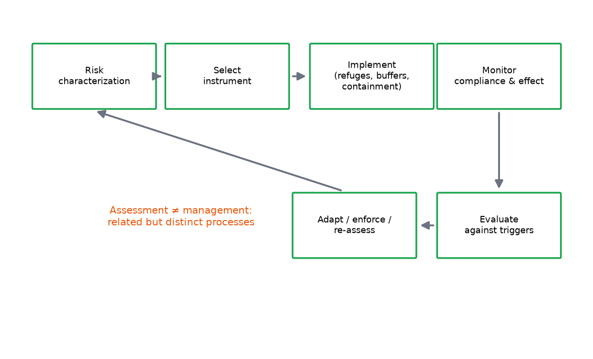

# Module 18 — Risk Management

**Level:** Intermediate → Advanced

---

## Learning objectives

1. Distinguish **risk assessment** (science: what is the risk?) from **risk management** (decision: what do we do about it?) — and show where they interact.
2. Categorize management options: avoidance, reduction at source, exposure blocking, mitigation, monitoring-triggered response.
3. Evaluate the major GMO management tools — refuges, isolation distances, buffers, stewardship programs, containment (GMMs) — by mechanism and effectiveness.
4. Explain why **compliance** is a biological parameter, and how management failures (S23) dominate real-world outcomes.

---

## Definition

**Risk management** is the process of deciding and implementing measures to avoid, reduce, or control characterized risks to acceptable levels — including the decision to accept residual risk with monitoring, or to refuse the release. It operates *after* (and informed by) assessment, and openly weighs values, feasibility, and cost alongside science.

## Why it matters

Almost no real approval is "release with no conditions": modern GMO regulation is overwhelmingly *conditional release* — the management plan is the license. Effectiveness of those conditions determines actual environmental outcomes. A technically correct assessment attached to an unenforceable management plan protects nothing (resistance compliance history is the standing lesson).

## Beginner explanation

Assessment says: "unmanaged, resistance is near-certain in N years." Management answers: "then we require refuges (biology), train farmers (compliance), monitor frequency (early warning), and set triggers (response)." Each measure is chosen because it moves a specific number in the risk chain. If a measure doesn't move a number, it's decoration.

## Scientific explanation

### 18.1 Assessment vs management (the boundary)

| | Risk assessment | Risk management |
|---|---|---|
| Question | "What is the risk, how certain?" | "What do we accept/do?" |
| Inputs | data, models, uncertainty | characterization + values + law + economics + feasibility |
| Output | risk statements/bands | conditions, refusals, standards, enforcement |
| Personae | scientists/assessors | regulators/policy/stakeholders |
| Failure mode | hidden assumptions | unenforceable conditions |

Interaction points: management feasibility can *constrain* assessment scenarios (assess the system as actually practiced); assessment urgency can *justify* management strength. But conclusions must not be quietly tuned to preferred policies — that's the integrity line.

### 18.2 The management option space

| Option class | Mechanism | GMO examples |
|---|---|---|
| **Avoidance** | don't release where/when risk is unacceptable | no-grow zones near compatible wild relatives; seasonal windows avoiding synchrony |
| **Reduction at source** | lower hazard generation | trait design (non-pollen-expressed toxins), male-sterile designs, chloroplast inheritance (where applicable) |
| **Exposure blocking** | interpose barriers in pathways | isolation distances, border rows, debris management, stream-buffer rules |
| **Population management** | dilute selection / protect susceptible gene pools | structured refuges (Module 11), herbicide-mode-of-action diversity (Module 12) |
| **Containment** | prevent escape/persistence | physical containment, auxotrophic/suicide designs (GMMs), terminator-of-use conditions in trials |
| **Mitigation of consequence** | reduce harm if exposure occurs | margin management, alternative-control reserves, compensation/restore plans |
| **Monitoring-triggered response** | detect → act | frequency triggers (resistance), patch reporting (weeds), indicator thresholds (biodiversity) |
| **Stewardship/education** | make measures actually happen | training, contracts, compliance incentives, community programs |
| **Emergency response** | planned reversal | recall/destruction protocols (trials, GMMs), remediation plans |

### 18.3 Tool-by-tool effectiveness notes (literature-consistent)

- **Refuges (Bt):** biologically the core selection-dilution tool (Module 11). Effectiveness ∝ compliance; non-recessive inheritance erodes it; placement matters with pest dispersal.
- **Isolation distances:** reduce pollen-mediated flow steeply but never to zero (Module 6 §6.4); combine with scheduling and border rows; distances are trait-consequence-specific.
- **Border rows:** act as pollen sinks; cheap, effective for crop-to-crop purity.
- **Herbicide diversity (HT systems):** the resistance lever; works only as a *system* property — mixed messages ("just add another chemistry") recreate the problem.
- **GMM containment:** genetic disability (auxotrophy), suicide switches, physical containment; *recovery* is the hard part — management emphasizes prevention + reversibility planning.
- **Stewardship programs:** convert paper conditions into field reality; the binding constraint on nearly every other tool. Compliance is a *model parameter*, not a footnote.

### 18.4 Compliance as a biological parameter

The simulated risk matrix ([DATA/risk-matrix](../downloads/risk-matrix.md)) makes the point structurally:

| Scenario | Score | Lesson |
|---|---|---|
| S06 resistance, no refuge | 20 (Very high) | unmanaged selection dominates |
| S07 resistance, structured refuge | 8 (Medium) | management works *when implemented* |
| S23 loss of refuge compliance over seasons | 12 (High) | the *failure mode of management itself* is a first-class risk |
| S25 monitoring fails to detect early resistance | 8 | the failure mode of the detection layer |

Assessments that assume perfect compliance systematically underestimate risk; sensitivity analysis should include compliance scenarios (Lab 10's refuge-compliance input is exactly this).

### 18.5 Choosing among options (decision logic)

```text
For each open pathway:
  1. Can avoidance eliminate it? (spatial/temporal) — cheapest if feasible
  2. Can source/exposure measures cut it with enforceable means?
  3. Residual risk after measures → acceptable? (values enter here)
  4. What monitoring detects failure early? (triggers defined)
  5. What is the response if a trigger fires? (pre-committed)
  6. Who is responsible, and what makes compliance real?
```

Pre-commitment (step 5) is what distinguishes adaptive management from improvised reaction (Module 20 §20.4).

## Step-by-step example: building a management package

For a Bt maize approval in a resistance-relevant region:

```text
- 20% structured refuges with placement guidance (dispersal-aware)
- Stewardship: annual training, seed-purchase linkage, spot audits
- Monitoring: annual F2 screen (n per region defined), frequency bands + triggers
- Pre-committed responses: band crossing → intensified education/inspection;
  second band → alternative tools mandated; field failure → event review
- Communication: plain-language farmer materials (Module 21)
- Documentation: compliance data reported with monitoring data
```

Each element maps to a characterized risk (Module 17) and a triggerable number.

## Figures

<figure markdown>


*Figure - The risk-management cycle: characterize, select instruments, implement, monitor, adapt.*
</figure>


## Interpretation

- Management is where characterized risk meets the world's friction; its honesty determines the license's real meaning.
- The strongest packages are *layered* (avoid → block → dilute → detect → respond) — single-tool packages are fragile.
- Every condition should name its mechanism ("this changes exposure magnitude by…") or it is not assessable.

## Common misconceptions

| Misconception | Reality |
|---|---|
| "Management = bureaucracy after the science" | It is the license's substance; biology depends on it |
| "Refuges/isolation distances make risk zero" | They reduce frequencies/likelihoods; residual risk + monitoring is the design |
| "Compliance is a legal matter, not scientific" | It is a model parameter with measurable population-genetic consequences |
| "Emergency plans are formalities" | For trials and GMMs, reversibility planning *is* the risk position |

## Exam points

- Draw the assessment/management boundary with one interaction in each direction.
- Classify five tools by option-class and mechanism.
- Explain S06→S07→S23 as one narrative of management value and failure.
- Draft a layered management package with mechanisms and triggers for an open pathway.

## Quick-check questions

1. Which management class does a border row belong to, and what number does it move?
2. Why must compliance appear inside the *assessment's* sensitivity analysis rather than only in policy documents?
3. A trigger fires two years running. What distinguishes adaptive management from improvisation here?
4. For a GMM release, why do containment and emergency response outweigh field-buffer-style tools?
5. Rewrite a vague condition ("farmers should be careful about refuges") into an enforceable, mechanism-named condition.

---

*Next: [Module 19 — Environmental Monitoring](../../risk/modules/19-Environmental-Monitoring.md): the data system that keeps the license honest.*---

## What you should know

Review the learning objectives and quick-check questions above. Then continue the sequence.

## What you should be able to do

- Test yourself with the [multiple-choice questions](../assessment/MCQs.md) and the [short-answer](../assessment/Short-Questions.md) and [long-answer](../assessment/Long-Questions.md) banks.
- Instructors: model answers are in the [answer key](../assessment/Answer-Key.md).
- Quick revision: [cheat sheet](../guide/cheat-sheet.md) and [FAQs](../guide/faqs.md).
- Hands-on practice: the [practical program overview](../labs/index.md).

[<- Risk Characterization](../modules/17-Risk-Characterization.md) &middot; [Course home](../index.md) &middot; [Continue to next module ->](../modules/19-Environmental-Monitoring.md)
