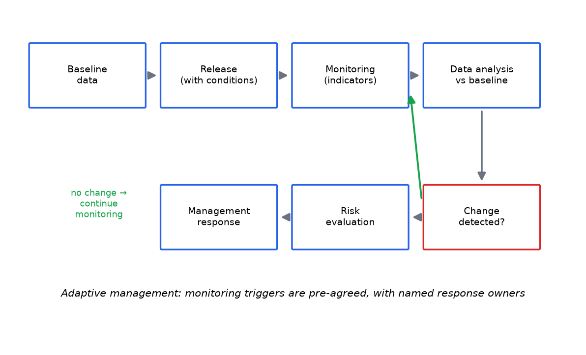

# Module 19 — Environmental Monitoring

**Level:** Intermediate

---

## Learning objectives

1. Explain monitoring's role: testing assessment assumptions, detecting change, triggering response.
2. Distinguish baseline data, compliance monitoring, case-specific monitoring, and general surveillance.
3. Apply the monitoring workflow (baseline → release → monitor → compare → evaluate → respond) with indicators and triggers.
4. Apply design principles: statistical power, indicator selection, attribution, and the detection-limit honesty rule.

---

## Definition

**Environmental monitoring** is the planned, repeated measurement of defined indicators in the receiving environment to (a) verify that the release behaves as assessed, (b) detect changes against baseline or expected ranges, and (c) trigger pre-committed management responses when thresholds are crossed.

## Why it matters

Assessments are predictions with uncertainty (Module 16). Monitoring is how predictions meet reality. It also supplies the *early-warning layer* (resistance frequencies, exposure anomalies) that converts late failures into early responses — the difference between a manageable finding and a legacy problem.

## Beginner explanation

You fitted a model that says pollen drift is negligible past 50 m. Monitoring puts traps at 10, 50, 200 m for three seasons and checks. You promised refuges would hold resistance below 1%. Monitoring screens moths every year and reports the frequency. Monitoring is the alarm system with the numbers you agreed in advance.

## Scientific explanation

### 19.1 The monitoring workflow

```text
Baseline data (pre-release: what does 'normal' look like?)
        ↓
Release (with management conditions)
        ↓
Monitoring (indicators × sites × schedule)
        ↓
Data analysis (quality control, statistics)
        ↓
Compare with baseline / expected range
        ↓
Detect change (or confirm no detectable change — with power statement)
        ↓
Risk evaluation (is the change adverse? assessment revision needed?)
        ↓
Management response (pre-committed triggers; adaptive adjustment)
        ↓ (loop back: monitoring continues, baseline updates)
```

### 19.2 Types of monitoring

| Type | Question | Design center |
|---|---|---|
| **Baseline** | what exists before release? | multi-season, multi-site pre-release data; the reference for everything after |
| **Case-specific (release monitoring)** | is THIS GMO behaving as assessed? | pathway-targeted: exposure compartments, gene-flow receivers, NTO sentinels |
| **Compliance monitoring** | are conditions actually followed? | refuge audits, isolation distances, records |
| **General surveillance** | any unexpected broader change? | existing networks (pest surveys, biodiversity schemes), adverse-event reporting |

The types answer different questions and are too often conflated; attribution power differs radically between them (case-specific designs attribute; general surveillance detects surprises without attribution).

### 19.3 Choosing indicators

Good indicators are: **relevant** (linked to a protection goal/pathway), **measurable** (standardized, affordable, repeatable), **sensitive enough** (responds to the stressor at plausible magnitude), **specific enough** (interpretable signal), and **trigger-able** (a threshold can be pre-defined).

| Pathway | Candidate indicators | Trigger example (illustrative) |
|---|---|---|
| Resistance | allele frequency (F2/allele screen) | frequency band crossing → stewardship escalation |
| Gene flow | outcrossing frequency in sentinel receivers | sustained above-model range → review isolation plan |
| Exposure | protein concentration in key compartment | exceedance of bounding range → fate model revision |
| NTO direct | sentinel survival in semi-field | repeated reduction beyond cage variation → field investigation |
| Biodiversity (community) | selected functional-group counts; process rates | multi-year trend beyond baseline CI → assessment revision |

Rule: *few, defensible, triggered* indicators beat long lists measured once.

### 19.4 Statistical power — the honest core

Detection is bounded by design: effect size detectable ≈ f(noise, n, design). Two binding rules:

1. **A null needs its power sentence:** "with n sites × seasons, changes ≥ X% would have been detected (power 0.8)." Without it, "no change" is uninterpretable (Module 16 §16.3).
2. **Small changes at landscape scale are expensive:** power for subtle trends demands long time series and many sites — budgeting reality that shapes what monitoring can honestly promise. Underpowered monitoring silently converts "no detection" into false reassurance.

### 19.5 Attribution — the second core

Detecting change ≠ attributing cause. Weather years, land-use shifts, and other practices co-move. Attribution strengthens with: pre-release baselines, paired/controlled comparisons (GM vs counterpart regions), mechanistic linkage (indicator ← pathway ← trait), and *a priori* hypotheses (register expected directions before data arrive). Case-specific designs carry attribution power; general surveillance mostly doesn't — different jobs.

## Step-by-step workflow: designing a monitoring program

```text
1. From the risk characterization: list open pathways + their assumptions
2. For each: define indicator, method, spatial/temporal design
3. Run power analysis: what change is detectable? (declare it)
4. Set triggers with pre-committed responses (Module 18 §18.5)
5. Baseline: how many pre-release seasons does the indicator need?
6. Budget reality-check: trim to defensible core; document what was cut
7. Report template: data → analysis → trigger evaluation → actions
8. Review cycle: indicators/baselines update as assessment revises
```

## Example data

Exposure-decay monitoring ([DATA/exposure](../downloads/exposure.md)): if the assessment assumed debris half-life ~35 days, monitoring samples debris monthly and flags model exceedance if measured half-life > ~50 days (bounding-range trigger). Resistance monitoring ([DATA/resistance](../downloads/resistance.md)): the gen-14 crossing of 1% in the no-refuge simulation is precisely the event the trigger architecture exists to catch — while there is still management time.

## Figures

<figure markdown>


*Figure - The adaptive monitoring loop: baseline, release, monitoring, evaluation, response.*
</figure>


## Interpretation

- Monitoring converts uncertainty from a paragraph into a work plan.
- The most valuable monitoring question is always: *"what observation would change our conclusion, and are we measuring it?"*
- Negative monitoring results *with power statements* are genuine evidence; without them, they are missing data wearing a lab coat.

## Common misconceptions

| Misconception | Reality |
|---|---|
| "Monitoring = sampling a lot of things" | It = measuring few decision-relevant indicators with power and triggers |
| "No change detected → all is well" | Only with declared detectable-effect size |
| "General surveillance attributes causes" | It detects; case-specific designs attribute |
| "Baseline can be reconstructed later" | Pre-release data are irreplaceable; start before release |

## Exam points

- Reproduce the workflow with one indicator + trigger example.
- Distinguish the four monitoring types and their attribution power.
- Write the power sentence for a given design and interpret a null.
- Explain why triggers must be pre-committed (link to adaptive management).

## Quick-check questions

1. Which monitoring type would catch a refuge-compliance collapse first, and how?
2. Your 3-site indicator shows a 15% decline, baseline CI ± 20%. What can be concluded — precisely?
3. Choose one indicator for gene flow monitoring and defend it against the five criteria (relevant, measurable, sensitive, specific, trigger-able).
4. Why does baseline duration (pre-release seasons) matter more for community indicators than for compliance metrics?
5. Design the report template fields for an annual monitoring program (headers only).

---

*Next: [Module 20 — Post-Market and Post-Release Monitoring](../../risk/modules/20-Post-Market-and-Post-Release-Monitoring.md): the regulatory machinery around long-term monitoring.*---

## What you should know

Review the learning objectives and quick-check questions above. Then continue the sequence.

## What you should be able to do

- Test yourself with the [multiple-choice questions](../assessment/MCQs.md) and the [short-answer](../assessment/Short-Questions.md) and [long-answer](../assessment/Long-Questions.md) banks.
- Instructors: model answers are in the [answer key](../assessment/Answer-Key.md).
- Quick revision: [cheat sheet](../guide/cheat-sheet.md) and [FAQs](../guide/faqs.md).
- Hands-on practice: the [practical program overview](../labs/index.md).

[<- Risk Management](../modules/18-Risk-Management.md) &middot; [Course home](../index.md) &middot; [Continue to next module ->](../modules/20-Post-Market-and-Post-Release-Monitoring.md)
