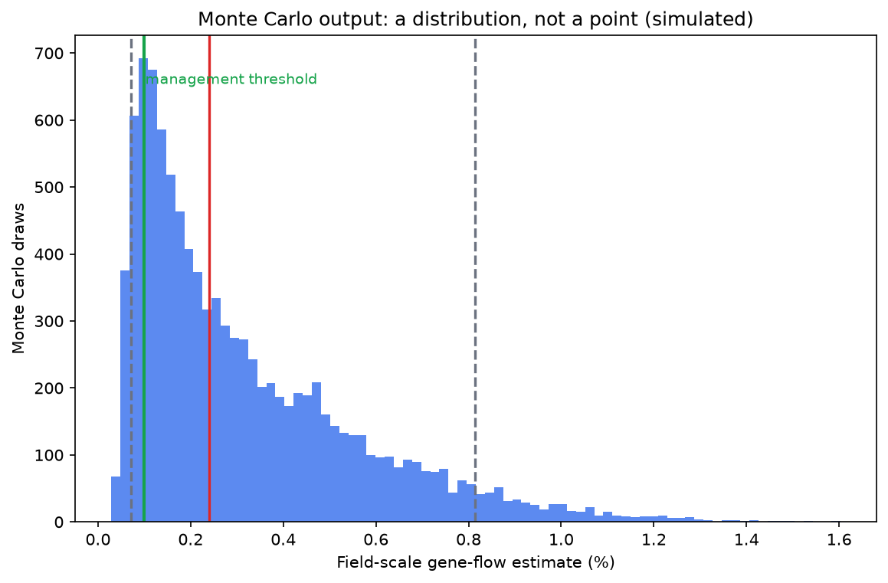

# Module 24 — Data Analysis for GMO Risk Assessment

**Level:** Intermediate → Advanced (computational)

---

## Definition

Risk-assessment data analysis converts raw field, laboratory, or monitoring observations into quantities a risk assessment can use: **effect sizes, frequencies, dose–response curves, probabilities, and their uncertainties.** This module teaches the standard toolkit on clearly labelled *simulated* datasets included in this course.

## Why it matters

Most ERA disputes are, at bottom, disputes about data: is the difference real, is it biologically meaningful, how uncertain is the estimate? A student who cannot read a confidence interval or a resistance-frequency trend cannot participate in that dispute.

---

## Beginner explanation

Every exercise in this module follows the same spine:

```text
Dataset → Question → Workflow → Analysis (Python) → Visualization
→ Result → Interpretation → Limitations → Advanced challenge
```

Start every analysis by writing the question in plain language. A result you cannot state as a sentence is not yet a result.

## Scientific explanation

### Core statistical concepts used throughout

- **Replication and design:** blocks, controls, randomized plots; pseudoreplication is the most common field-study flaw.
- **Estimation over pure significance:** report effect sizes with 95% confidence intervals (CIs), not just p-values.
- **Proportions and frequencies:** gene-flow frequency, resistance allele frequency, survival proportions — analysed with binomial logic (Wilson intervals preferred at small n).
- **Dose–response:** logistic models for mortality vs dose; LC50 estimation conceptually.
- **Trend over time:** resistance build-up is a *recursion/selection* phenomenon — model frequencies across generations.
- **Community data:** soil/arthropod community comparisons use ordination (PCA/PCoA) and diversity indices rather than single-species tests.
- **Multiple testing:** field studies measure many endpoints — state the correction (e.g., Benjamini–Hochberg) or interpret cautiously.

### The ten course datasets (DATA/ folder)

| # | Dataset | Analysis taught | Key output |
|---|---|---|---|
| 1 | `gene-flow/` | Pollen-mediated hybrid frequency vs distance | Fit of a decay model; isolation-distance implication |
| 2 | `non-target/` | Survival of beneficial insects by treatment | Survival proportions + CIs; hazard-without-exposure contrast |
| 3 | `resistance/` | Resistance allele frequency over generations | Selection recursion; refuge effect on build-up |
| 4 | `herbicide-weeds/` | Resistant weed biotype counts by herbicide programme | Rotation/mixture effect on frequency |
| 5 | `soil-community/` | Microbial OTU counts across GM vs conventional plots | Diversity indices; ordination; overlap of variation |
| 6 | `composition/` | Compositional analytes GM vs comparator | Equivalence intervals; % difference vs range of conventional lines |
| 7 | `exposure/` | Pollen density and protein concentration on in-field/margin stations | Exposure-magnitude mapping |
| 8 | `dose-response/` | Mortality vs dose for target and non-target species | Logistic curves; species contrast in LC50 |
| 9 | `risk-matrix/` | Scored hazard/exposure pairs | Risk ranking; matrix placement sensitivity |
| 10 | `uncertainty/` | Parameter distributions for an outcrossing estimate | Monte Carlo interval; sensitivity ranking |

Run `python DATA/analysis_demo.py` from the course root to reproduce every documented answer; run `python DATA/generate_datasets.py` to regenerate identical data (seeded).

---

## Step-by-step workflow (generic, applied in every lab)

1. **Frame the question** as a risk-assessment sub-question (e.g., "does isolation distance reduce outcrossing below a management threshold?").
2. **Inspect data** — units, missingness, design (who is the replicate?).
3. **Choose the estimand** — a frequency, a mean difference, an LC50, a ratio.
4. **Fit/summarise** with the simplest adequate model; check assumptions.
5. **Visualise** — show raw data plus fitted summaries; never hide the noise.
6. **Interpret in ERA terms** — hazard? exposure? both? which module of the framework does this inform?
7. **State limitations** — design, sample size, extrapolation, realism.
8. **Advance it** — sensitivity analysis or alternative model as challenge.

## Worked example — Exercise 1 (gene flow), abridged

Data: hybrid frequency at 1, 5, 10, 25, 50, 100 m from a pollen source, 12 plots per distance (simulated).

```python
import pandas as pd, numpy as np
gf = pd.read_csv("DATA/gene-flow/gene_flow_by_distance.csv")
gf.groupby("distance_m")["hybrid_frequency"].agg(["mean", "sem"]).round(4)
```

Typical result (simulated): mean frequency falls from ≈0.030 at 1 m to ≈0.0002 at 100 m — a strong negative exponential decay. Fitting `y = a·exp(−b·distance)` gives the shape, and the ERA question becomes: *at what distance does the upper 95% bound fall below the management threshold?* Interpretation: buffer zones work because they act on the steep part of the curve; the long tail means zero gene flow is unattainable, so "acceptability" is a management judgment, not a detection limit.

**Limitations:** one season, one pollen-source size, one variety pair; real landscapes add wind patterns, flowering overlap, and field-size variation.

---

## Example data — reading a proportion table correctly

Survival table (Exercise 2, simulated):

| Treatment | n | alive | survival |
|---|---|---|---|
| Control diet | 200 | 186 | 0.930 |
| Bt-pollen diet (high) | 200 | 179 | 0.895 |

A naive reading says "Bt killed more insects." The correct reading: survival difference 3.5 percentage points, Wilson 95% CI on the difference roughly [−1.5, +8.5] — **compatible with no effect**; and even the point estimate is far below the mortality the same species shows from a single conventional insecticide application (the ERA comparator). Exercise 2 exists precisely to teach this triple move: estimate → interval → comparator.

## Figures

<figure markdown>


*Figure - Monte Carlo output is a distribution: median, interval and threshold exceedance, not a point.*
</figure>


## Interpretation discipline (course-wide rules)

1. **Never report a bare p-value alone** — always with effect size and interval.
2. **Never equate statistical significance with biological relevance** — Module 16 logic.
3. **Always name the comparator** — sprayed conventional? unsprayed isoline? wild-type baseline?
4. **Always propagate uncertainty** into any downstream risk statement — Module 17/23 logic.
5. **Label simulated data as simulated** in every figure you make.

## Common misconceptions

- *"The CSV says frequency = 0.000, so there is no gene flow."* Sampling can miss rare events; distinguish "not detected" from "absent."
- *"A significant soil-community difference proves harm."* It proves a difference; ecological relevance (Module 9/16) must be argued separately.
- *"More decimals = more precision."* Precision comes from design and n, not decimal places.
- *"Simulated data are fake science."* They are teaching instruments; the *logic* they train transfers to real dossiers.

## Exam points

- Wilson vs naive binomial interval (small-sample behaviour).
- Why the exponential-decay model suits gene-flow-by-distance.
- What a refuge does to the resistance recursion (Exercise 3's headline result).
- Equivalence testing logic in compositional analysis (Exercise 6).
- What sensitivity analysis contributes to an uncertainty statement (Exercise 10).

## Quick-check questions

1. Your gene-flow plot shows a long tail: frequency never reaches zero. Does that make buffer zones pointless?
2. In Exercise 2, the difference is not significant. Is the correct ERA conclusion "Bt pollen is harmless"? What more is needed?
3. Why does Exercise 3's resistance curve rise slowly, then steeply?
4. What does an equivalence interval in Exercise 6 tell you that a t-test does not?
5. Exercise 10 ranks input parameters by influence on the output. How does that guide data collection?

### Self-check answers

1. No — it means risk is managed by reducing frequency below thresholds, and acceptability is a policy choice informed by the curve.
2. No — absence of detectable effect at this dose/duration ≠ absence of hazard or risk; check power, dose realism, life stage, and the comparator.
3. Selection acts on existing variation: early generations remove susceptible alleles slowly (frequency-proportional), but recessive/resistance advantage compounds as resistant alleles become common — the classic S-curve; refuges flatten it by supplying susceptible mates.
4. It states whether differences fall *within* pre-set equivalence margins around the comparator — directly relevant to substantial-equivalence judgment; a t-test can "pass" by being underpowered.
5. It tells you which parameters drive the risk estimate — measure those better first (a resource-prioritisation tool).

---

*Previous: [Case Studies](../../risk/modules/23-Case-Studies.md) · Next: [Advanced Topics](../../risk/modules/25-Advanced-Topics.md)*---

## What you should know

Review the learning objectives and quick-check questions above. Then continue the sequence.

## What you should be able to do

- Test yourself with the [multiple-choice questions](../assessment/MCQs.md) and the [short-answer](../assessment/Short-Questions.md) and [long-answer](../assessment/Long-Questions.md) banks.
- Instructors: model answers are in the [answer key](../assessment/Answer-Key.md).
- Quick revision: [cheat sheet](../guide/cheat-sheet.md) and [FAQs](../guide/faqs.md).
- Hands-on practice: the [practical program overview](../labs/index.md).

[<- Case Studies](../modules/23-Case-Studies.md) &middot; [Course home](../index.md) &middot; [Continue to next module ->](../modules/25-Advanced-Topics.md)
